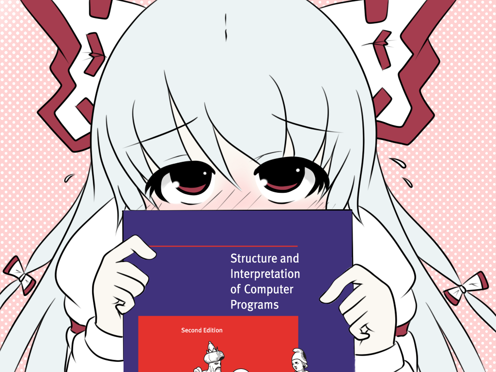
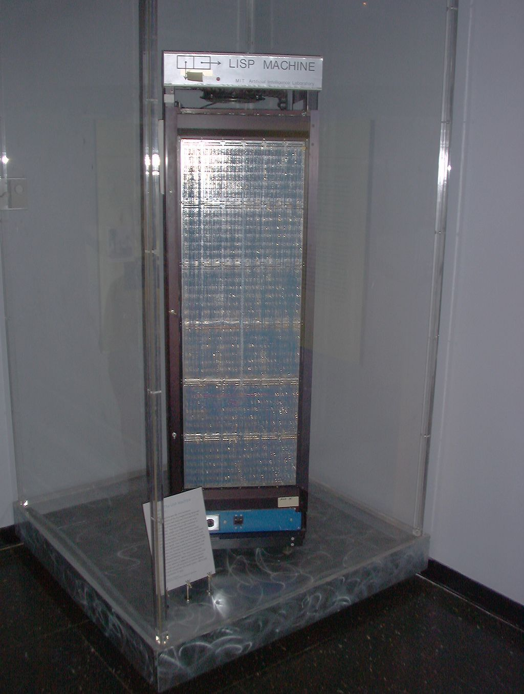

## (learn (LISP))
(by (skilbjo))

### (why? (LISP))
LISP is the language of the gods. It is the ultimate hacker's language. That comes
from both from its tinkering history (how many LISP dialects are out there? how
many stars are in the sky?), its elegant syntax and design, and finally, its open
and flexible macro system.

On history, LISP was the second (after Fortran) earliest high-level
programming language. It was a pioneer in design, thought, and  implementation
of high-level programming languages, years before tools and technologies like C,
bash, Unix, and networks like ARPANET were 10+ years out from being developed.

On syntax and design, LISP's LISP's native data structure is a list, and LISP source
code is written as a list. This concept is called homoiconicity, which means that
the program structure is similar to its syntax. If a language is homoiconic, the
source code has the same structure as its abstract syntax tree, which allows the
code in the language to be accessed and transformed as data.  LISP is expressive,
has symmetry to it, and is beautiful many ways.

On macros, LISP is wide open and flexible, because its macros are pre-processed
and returned as forms to the compiler, they are not values to be evaluated by
the compiler. With this, you can write code that will write your own code.
You can define your own syntax, write your own domain specific language, or
implement another language using LISP (for example, a python interpreter implemented
as macros in LISP).  You can create any sort of programming paradigm you like and
include it in your programs. If you can imagine it, you can do it. It enforces
no structure (except (make (sure (to (balance (your parens!)))))).

### (history (and background))
LISP is one of the oldest high-level programming languages in use today.
Described by neckbeards as having mystical origins, it was created by
John McCarty in the mid 1950s while at MIT. LISP's development was influenced
by Alonzo Church's lambda calculus, developed in the 1930s, which is a formal
mathematical logic using function abstraction and application using
binding and substitution.

It was first implemented on an IBM 704. It soon made its way to a PDP-1
(note, Unix was first run on a PDP-7 by Ken Thompson and Dennis Ritchie about
10 years later) soon after by Steve Russell, who read McCarty's paper. McCarty
was suprised by Russell's work and didn't realize `eval` could be implemented
in machine code.

LISP's names comes from LISt Processor. In LISP, code is data and data is code.
Unlike other languages, source code is either data or code.

A current popular LISP used today is called Clojure, which is a functional and
dynamically typed language that compiles to java byte code and thus can be turned
into a `.jar` file and run everywhere java can. Compiling source code into an
executable jar is as easy as: `lein uberjar` and then running the jar in the
java runtime with: `java -jar my_jar.jar`.

Note Clojure is different from another LISP dialect called Clozure CL, a common
lisp implementation. Additionally note that Clojure is also different from the
programming concept known as a closure, which is a technique in programming to
bind variables for use in higher-order functions. Note that also you can
implement many closures in Clojure or Clozure CL.

### (basic (concepts))
In LISP, all source code is represented by symbolic expressors, or S-expressions,
or nested tree-structured lists. A list looks like this: `()`. A list takes two
froms: a form to be evaluated, and a data form.

The data form is with a quote prefixing the list, `'()`, or `'(2 4 6)`.
If the list is to be evaluated, the list starts with a functional call, and then
with arguments to the function. A function `f` that takes two arguments would be
called like so: `(f arg1 arg2)`.

For example, to cast and concatonate the integer `2600` with the string
`" is the ultimate hacker magazine"`, you'd call the `str` function on those two
datatypes. Do the following in a LISP REPL or LISP source code:

    => (str 2600 " is the ultimate hacker magazine")
    "2600 is the ultimate hacker magazine"

To add 2 to 4, call the `+` function on those two datatypes:

    => (+ 2 4)
    6

To print something to standard out:

    => (println "Clojure is a mystical language")
    "Clojure is a mystical language"

To create a variable, you use the reserved word (which is actually a macro behind the
scense) `def` along with the name of the variable and then the variable value.
For example, `(def a-lisp-dialect "Clojure")`.  You can then use it like so:
`(println a-lisp-dialect)`.

To create a function, use the reserved word (also a macro) `defn` along with arguments
given in a vector, and then the function definition. Clojure, as a functional language,
omits the return keyword and every function definition uses an implicit return.
For example,

    (defn my-squarer [num]
      (* num 2))

### (cons (car (cdr (and recursion))))
In the early days, two assembly language macros for the IBM 704 became well-known
functions for operating on lists: car (Contents of the Address part of the
Register number) and cdr (Contents of the Decrement part of the Register number).

Recall that the basic datastructure in LISP is a list, `()`. This is also referred
to as a cons cell, made of two items: a value, and a reference pointing to another
cons cell. So take the list `'(2 4 8)`. This can alternatively be written as
`'(2 (4 (8 nil)))` using the cons cell paradigm.

The car is the first element of a list. For `'(2 4 8)`, 2 is the car.
The cdr is the rest of the list, except for the first element. If the rest of
the list is empty, the cdr is nil. In the above list, the cdr is `'(4 8)`

Let's expand on these to build a recursive function.  Since LISP has a functional
programming mystique (more on that soon), if we want to operate on this collection,
we would want to use recursion. We also want to use functions to help us as we recurse.

Suppose we are given a list, `'(2 4 8)`, and a task, to write a recursive function
that will sum the items in the collection.

A way to write a recursive function on this list would be to check if the list
is empty, and if not, pop the first element off, add that element to our accumulator,
and then recur.

    (defn recursive-sum
      [list acc]
      (if (empty? list)
        acc
        (recur (recursive-sum (cdr list) (+ acc (car list))))))

### (functional (programming))
Functional programming and LISP often go together when one sings the praises of
one of those concepts. Functional programming is the concept that the most of your
program can be represented in functions, and that you can trust those functions to
perform the action you expect. This is in contrast to imperative programming, where
you tell the computer what to do, and the program changes state. Functional
programmers dislike mutable (changing) state, and value "pure" functions, or
functions that given the same arguments, always have the same return value.
An example of these might be the following:

#### (imperative (form (in javascript)))
    var sum_of_array_items = function(arr){
      var sum = 0;
      for (var i=0; i<= arr.length - 1; i++){
        sum+=arr[i];
      }
      return sum;
    }

Program state is represented by position inside the for loop, as well as the
temporary variables `i` and `sum`.

#### (functional (form (in clojure)))
    (defn sum-of-list-items [my-list]
      (reduce + my-list))

Similar to the above, this function takes a collection (can be a `()` or `[]`  datatype,
similar to an array in Javascript or list in python), and calls reduce with the `+`
function on every element of the collection. Since reduce takes a function (`+`), a
collection, and an optional accumulator, and this returns the sum of the list above.

Another way to think about calling reduce on a collection with a `+` operator would
look like: take a list: `'(2 4 8)` but place a `+` between every element in the
collection, so: `(2 + 4 + 8)` (or in LISP, `(+ 2 (+ 4 (+ 8 nil)))`.

### (lisp-1 (vs lisp-2))
Diehards in the LISP community may debate LISP-1 vs LISP-2. LISP-2 treats
functions as values, so in order to make a function call, you must prefix the
function call with a special `funcall` operate, or else the function is treated
as data. LISP-1 is a bit more conductive to functional programming by assuming
that unless quoted, the list is a list to be evaluated, and the function exists
in the first position of the list.

An example of a LISP-1:
    (sort > '(5 2 6 3 1 4))

And the same example in LISP-2 form:
    (sort #’> '(5 2 6 3 1 4))

Note the difference between the `#'` prefix for the `>` function call.

### (scheme (vs common-lisp))
One of the side-effects of a language of a language as old as LISP is there are
many, many different implementations. In the 1980s, an effort was made to standardize,
with a specification called Common LISP. Common LISP (CL) focuses on practicality, so
it is easier to get projects started and write less code in CL. However, purists
disagree with the tradeoff of practicality over form.

An example of Common LISP for computing a factorial (a factorial is the product
of all the integers below it, ie factorial of 5 is 5 * 4 * 3 * 2 * 1):

    (defun factorial (n)
      (if (= n 0)
          1
          (* n (factorial (- n 1)))))

Scheme, in contrast, is the most beautiful representation of LISP. If programming
were art it would be represented as Scheme LISP. It is one of the few languages that
support tail-call optimization (write recursive functions, which
usually has poor space and time complexity in Big O notation, for iterative space
and time complexity - so the best of both worlds - elegant source code with fast
performance and small footprint on the stack and heap).

An example in scheme of a recusrive and tail call optimized function for computing a
factorial:

    (define (factorial n)
      (fact-iter 1 n))
    (define (fact-iter product n)
      (if (< n 2)
          product
          (fact-iter (* product n)
                     (- n 1))))

### (macros)
Macros are one of the more interesting features of LISP, which allow you to transform
LISP code. With it, you can change the language, implement your own features, or
even write a new programming language entirely. During the macro-expansion phase,
the LISP expression will be passed in to the macro function, which can do arbitrary
computation at macro-expansion time, the result of which will be LISP code. The
LISP code is then passed to the interpreter or compiler, which is then executed at
run time.

LISP macros result in unrestricted string rewriting, which is Turing Complete. LISP is
also Turning Complete; therefore with macros you can write code that will write your
code for you.

Let's implement. Clojure doesn't have a for loop like many programming languages do.
Clojure is too functional for that, and would prefer for example you apply a function
to the elements of the collection instead, ie `(map #(* % %) '(2 4 8))` to multiply a
number by itself (note `#()` is itself a macro for the Cljoure lambda function
which looks like: `(fn [args])`). However, we can write a macro `for-loop`, that
will pre-process all of our calls to `for-loop` and turn them into regular Clojure
code.

    (defmacro for-loop [[sym init check change :as params] & steps]
     `(loop [~sym ~init value# nil]
        (if ~check
          (let [new-value# (do ~@steps)]
            (recur ~change new-value#))
          value#)))

Use like so:
    (for-loop [i 0 (< i 10) (inc i)]
      (println i))

### (fun (facts))
Earmuffs: In Clojure, variables are declared with a `def` statement. If the variable
is intended to be used globally, it gets earmuffs, or `@` surrounding it. So a local
variable: `(def my-favorite-language "Clojure")` vs a global var:
`(def @my-favorite-language@ "Clojure")`.

LISP Machine: The 1980s had a burst of activity for LISP, as it was the favored
artificial intelligence language. Most computers (still, to this day) use a von Nuemann
architecture of a central processing unit (CPU) that fetches data from memory
via a bus to a memory register in the CPU, executes an instruction, and ultimately
writes data back to memory via the bus. In this architecture, the bottleneck is
the bus since the CPU must "waste" clock cycles fetching and retrieving data
from the bus. AI programs in the 60s and 70s required a considerable amount of
processor time and memory space. As the integrated circuit technology shrank the
size and cost of computers, and the memory needs of AI programms exceeded
current computers, researchers tried a new approach: a computer specifically
designed to run large AI programs and tailored to the semantics of the LISP language.

### (lisp (implementations))

- [Common Lisp](https://common-lisp.net/)
- [Scheme](https://www.gnu.org/software/mit-scheme/)
- [Armed Bear](https://common-lisp.net/project/armedbear/)
- [Clozure](http://ccl.clozure.com/)
- [Steel Bank CL](http://www.sbcl.org/)
- [Emacs LISP](https://www.gnu.org/software/emacs/manual/eintr.html)
- [Racket](https://racket-lang.org/)
- [Hy](http://docs.hylang.org/en/latest/)
- [Clojure](https://clojure.org/)

### (if (conclusion?) (learn LISP!))
LISP is indeed the language of the gods! It is a language that is written well.
Learning LISP will change the way you think about programming.
Now, go learn you a LISP for great good!

### (references)
- http://www-formal.stanford.edu/jmc/history/lisp/lisp.html
- http://www.paulgraham.com/lisp.html
- https://en.wikipedia.org/wiki/Lisp_(programming_language)
- https://en.wikipedia.org/wiki/Scheme_(programming_language)
- https://en.wikipedia.org/wiki/Tail_call
- https://en.wikipedia.org/wiki/Common_Lisp
- https://en.wikipedia.org/wiki/Lisp_machine
- http://stackoverflow.com/questions/4578574/what-is-the-difference-between-lisp-1-and-lisp-2
- http://stackoverflow.com/questions/9981943/how-to-implement-a-for-loop-in-clojure
- http://wiki.c2.com/?LispMacro
- http://stackoverflow.com/questions/1986961/how-is-the-var-name-naming-convention-used-in-clojure
- https://github.com/metawilm/cl-python/blob/master/parser/grammar.LISP
  (a python interpreter implemented using Common Lisp macros)
- https://en.wikipedia.org/wiki/Homoiconicity
