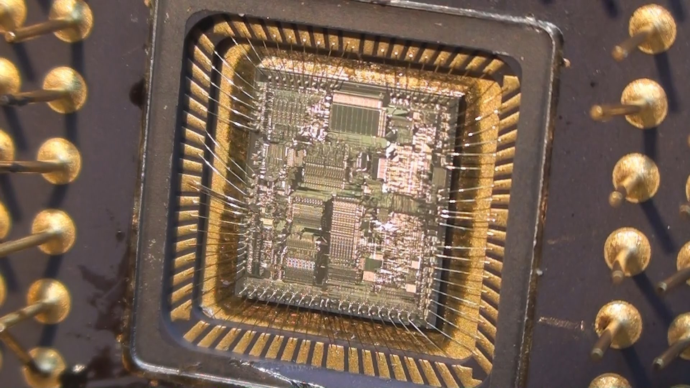

# articles

## What

Collection of articles I've gotten published or presented.

## Topics

### Devops & deployment on a home data center
[article](./odroid/deployment.md)
Published by Odroid Magazine, March 2017 issue, page 20: [https://magazine.odroid.com/201703](https://magazine.odroid.com/201703)

### Clojure, the JVM, and AWS Lambda
[article](./talks/clojure_aws_lambda.md)

### CPU Architecture
[article](./talks/cpu_architecture.md)

### Plan 9 from Bell Labs
[article](./talks/plan9.md)

### UNIX
[article](./talks/unix.md)

### Kernel Architecture & Operating Systems
[article](./talks/kernel_architecture.md)

