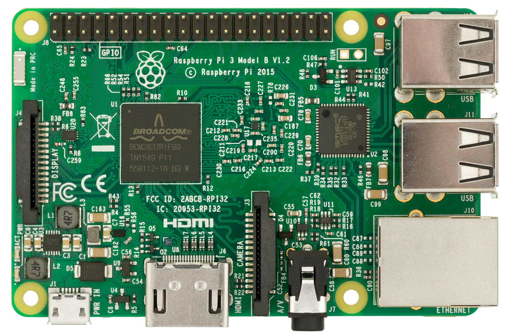

# converting a clojure project to aws lambda runtime

### Background


My life, 14 hours a day and 6 days a week. Why am I alive?



Best $50 investment I've made in my career


Funding Circle hired me as an engineer in June 2016.


I was told during the interview we'd be programming in Clojure. What is Clojure?
I think I've heard of closures before. Something with scope? It's a LISP? Isn't
that something ultra-neckbeards philosophize about but can't actually build
anything with?

Fast forward two years...

## markets-etl

Wanted to set up an ETL of financial data, not just equity prices, but also bond
yields, risk free rate of return, GDP data, currency prices, and real estate
indecies by zip code.

Quandl has this data available in an API, so wrote a Clojure wrapper around that
and began importing that data onto a small postgres server on a raspberry pi on
my own network in my apartment.

However, none of the fancy distributed systems technologies (Apache Mesos) we
have at work.

```bash
@mbp:markets-etl $ tree -I 'test|dev-resources|deploy'
.
├── LICENSE
├── README.md
├── project.clj
└── src
    ├── jobs
    │   ├── currency.clj
    │   ├── economics.clj
    │   ├── equities.clj
    │   ├── interest_rates.clj
    │   └── real_estate.clj
    └── markets_etl
        ├── api.clj
        ├── sql.clj
        └── util.clj
```

in `src/`, `jobs/` which are the business logic, and `markets_etl/` which act
as internal libraries for the project, such as an api wrapper, a sql
wrapper, and shared utility functions

```bash
@mbp:markets-etl $ tree deploy/
deploy/
├── bin
│   ├── run-docker
│   └── run-job
├── default
│   ├── Dockerfile
│   ├── Dockerfile.arm
│   ├── post-receive
│   └── publish-image
├── qemu
│   └── qemu-arm-static
└── tasks
    └── crontab
```

CI & deploy strategy is with CircleCI / quay.io / Docker / bare metal on both
ARM and x86 platforms. For any PR, Circle will check out the repo and use the
`publish-image` script to create an x86 and ARM docker container and publish
those to quay.io.

A `post-receive` git hook lives on target machines which checks out the code
and places the `crontab` file in necessary directories (FreeBSD in `/var/cron/tabs`
and Linux in `/etc/cron.d/`. Cron file has runtime information and also cleans
the docker cache (`docker images | xargs docker rmi`) for automated pulls from
quay.io for new commits to master.

The entrypoint is the `bin/run-docker` script

```bash
#!/usr/bin/env bash
set -eou pipefail

case $(uname -a) in
  *amd64* | *x_86* | *x86_64* )
    arch="x86" ;;
  *arm* )
    arch="arm" ;;
esac

img="quay.io/skilbjo/$app_name:$arch"
job_cmd="usr/local/deploy/bin/run-job"

docker run --rm \
  -e jdbc_db_uri="$(echo $jdbc_db_uri)" \
  -e quandl_api_key="$(echo $quandl_api_key)" \
  -e healthchecks_io_api_key="$(echo $healthchecks_io_api_key)" \
  "$img" \
  "$job_cmd" $@
```

which calls the `bin/run-job` script once in the container to launch the jar file.

```bash
#!/usr/bin/env bash
set -eou pipefail

java_opts="-Xms256m \
           -Xmx512m \
           -XX:MaxMetaspaceSize=128m \
           -server \
           -Duser.timezone=PST8PDT"
cmd="java $java_opts -jar app.jar"

# Prereqs
set +e
apk fix || echo 'Unable to reach apk... continuing...'
set -e

exec $cmd $@
```

A sample job:

```clojure
(ns jobs.currency
  (:require [clojure.java.jdbc :as jdbc]
            [markets-etl.api :as api]
            [markets-etl.sql :as sql]
            [markets-etl.util :as util])
  (:gen-class))

(def datasets
  '({:dataset "CURRFX"
     :ticker ["EURUSD" "GBPUSD"]}))

(def query-params
  {:limit      20
   :start_date util/last-week
   :end_date   util/now})

(defn execute! [cxn data]
  (jdbc/with-db-transaction [txn cxn]
    (->> data
         (map prepare-row)
         flatten
         (map #(update-or-insert! txn %))
         doall)))

(defn -main [& args]
  (jdbc/with-db-connection [cxn (-> :jdbc-db-uri env)]
    (let [get-data (fn [{:keys [dataset
                                ticker]}]
                     (->> ticker
                          (map (fn [tkr]
                                 (-> (api/query-quandl! dataset
                                                        tkr
                                                        query-params)
                                     (assoc :dataset dataset :ticker tkr))))))
          data        (->> datasets
                           (map get-data)
                           flatten)]

      (execute! cxn data)))
```

## aws lambda

EC2 containers, virtualized computers. But what about when you only need it now
and then? Script to go launch EC2 and run your job, and then shut down? You're
paying for all that time.

AWS realizes a split in what computers do: compute, internet, and storage. Cloud,
revolutionize, save the world, big data, etc etc.

So, to migrate from apartment to cloud, yet still free (AWS Lamba is 1M free
requests per month), I started to investigate.

AWS Lambda quick facts:
- 2014 product launches
- initially only node.js, max 1 minute runtime, no VPC support
- mid-2015 java8, max 5 minute runtime
- launches LXC container (LXC is similar to docker containers) when invoked
- billed in 100ms increments, pay for startup
- openjdk 1.8
- no control of startup flags, last two flags make startups less painful

```
java \
  -XX:MaxHeapSize=85% of configured Lambda memory \
  -XX:UseSerialGC \                   # overriding default garbage collector with Serial GC
  -XX:+TieredCompilation \
  -Xshare:on \                        # Class data sharing,
  -jar app.jar
```

Script for turning a clojure project into a jar and uploading it:

```bash
build() {
  deploy/build-project

  lein uberjar && \
    cp "target/uberjar/${app}.jar" app.jar
}

new(){
  build

  aws --profile personal \
    lambda create-function \
    --region us-east-1 \
    --function-name "${app}" \
    --zip-file 'fileb://app.jar' \
    --role arn:aws:iam::470340682667:role/lambda_with_athena \
    --handler "jobs.aws-lambda" \
    --runtime java8 \
    --profile default \
    --timeout 10 \
    --memory-size 360
}
```

But, entrypoint is all off. What is the entrypoint? Unlike control of the cron
script, which calls `java -jar /app.jar -m jobs.currency`, there is no control.
Give up?
Actually, you tell AWS Lambda what the entrypoint is. Note this flag in the aws
cli call from above: `--handler "jobs.aws-lambda"`

```clojure
(ns jobs.aws-lambda
  (:require [jobs.currency :as currency]
            [jobs.economics :as economics]
            [jobs.equities :as equities]
            [jobs.interest-rates :as interest-rates]
            [jobs.real-estate :as real-estate]
            [markets-etl.util :as util])
  (:gen-class
    :name "jobs.aws-lambda"
    :implements [com.amazonaws.services.lambda.runtime.RequestStreamHandler]))

(defn main []
  (let [_              (println "Starting jobs... ")

        currency       (currency/-main)
        econmics       (economics/-main)
        equities       (equities/-main)
        interest-rates (interest-rates/-main)
        real-estate    (real-estate/-main)

        _              (println "Finished!")]))

(defn -handleRequest [_ event _ context]
  (let [event' (-> event
                   io/reader
                   (json/read :key-fn keyword))]
    (main)))
```


Set a cloudwatch rule to call the entrypoint once a day.

## Additional Follow Ups (another talk?)
- RDS only free for 1 year. However, similar fashion, AWS Athena is database
on demand using S3 and Presto (similar to Hadoop / Hive)- for SQL in text files.
- AWS Athena pricing is $5 per terabyte scanned, with a minimum of 10mb. Equivalent
pricing for small queries is $0.00005 per query, meaning price is $0.01 per
2,000 queries. Equivalent RDS pricing (smallest instance: t1.micro: $150 / year).
- AWS Lambda to update metastore partitions when new file added
- web server to use AWS Athena JDBC driver to get data

```bash
@mbp:~ $ curl -s https://skilbjo-aws.duckdns.org/api/currency/latest | jq '.body[] | select(.currency == "GBP")'
{
  "date": "2018-01-17T00:00:00Z",
  "rate": "1.3798813819885",
  "high_est": "1.3844662904739",
  "low_est": "1.3758565187454",
  "dataset": "CURRFX",
  "ticker": "GBPUSD",
  "currency": "GBP",
  "s3uploaddate": "2018-01-20T08:00:00Z"
}
```
