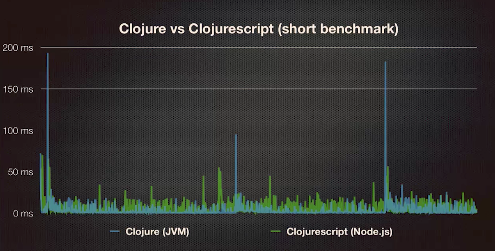
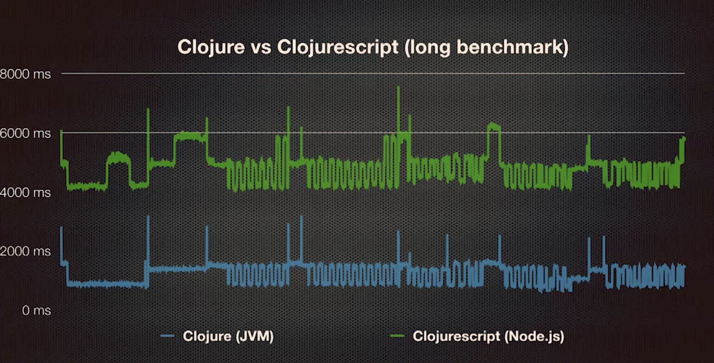
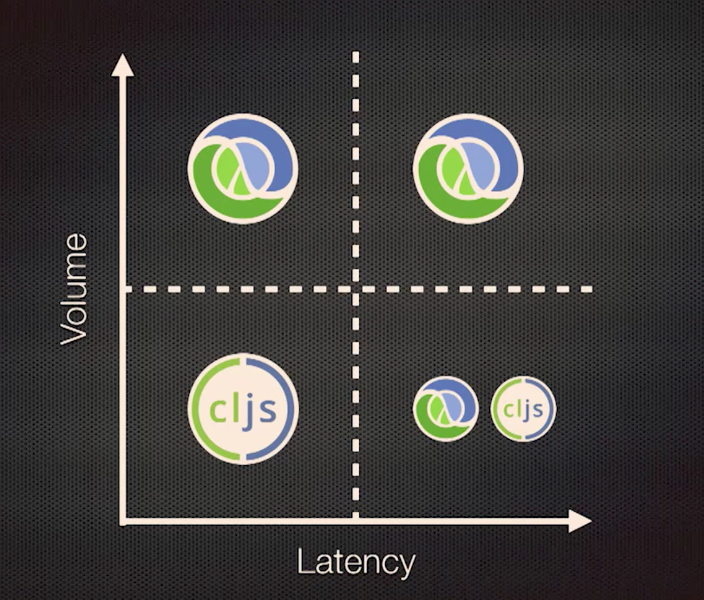

# Write Clojure for AWS Lambda
## Background
- 2014 AWS Lambda product is introduced
- initially only node.js, max 1 minute runtime
- mid-2015 java8
- late-2015 python, max 5 minute runtime, VPC support

## How it works
### LXC container
- billed in 100ms increments
- behind the curtains, startup is in an LXC container (LXC is similar to docker)
- container created on demand when lambda is invoked
- minimum keep-alive for container is 5 minutes
- maximum keep-alive for container is 4 hours
- container cold start is costly
-- first invocation, changed code, increased concurrency (scaling horizontally, massive parallelization)

### Ephemeral JVM (openjdk 1.8) on LXC container:
    java \
      -XX:MaxHeapSize=85% of configured Lambda memory \
      -XX:UseSerialGC \                   # overriding default garbage collector with Serial GC
      -XX:+TieredCompilation \
      -Xshare:on \                        # Class data sharing,
    -jar app.jar

- Last two flags make cold stars less painful
- No control of startup flags
- Pay for startup time, so less startup time = less $$

## Tooling
- Standard `deploy/` and `src/` folders.

-- `publish_jar` (similar to circleci/jenkins)

    #!/usr/bin/env bash
    set -eou pipefail

    app="us-athena-updater"

    build() {
      lein uberjar && \
      cp "target/${app}-0.1.0-SNAPSHOT-standalone.jar" app.jar
    }

    cleanup() {
      if [[ -f app.jar ]]; then rm app.jar; fi
      if [[ -d target ]]; then rm -r target; fi
    }

    update() {
      build
      aws lambda update-function-code  \
        --region us-east-1 \
        --function-name "$app" \
        --zip-file fileb://app.jar
      cleanup
    }

    new(){
      build
      aws lambda create-function \
        --region us-east-1 \
        --function-name "$app" \
        --zip-file file://"${app}" \
        --role arn:aws:iam::755865716437:role/lambda_with_athena \
        --handler "${app}" \
        --runtime java8 \
        --profile default \
        --timeout 10 \
        --memory-size 128
      cleanup
    }

    update

-- `event` for similar S3 trigger that gets sent to AWS Lambda

    {
       "Records":[
          {
             "eventVersion":"2.0",
             "eventSource":"aws:s3",
             "awsRegion":"us-east-1",
             "eventTime":"1970-01-01T00:00:00.000Z",
             "eventName":"ObjectCreated:Put",
             "userIdentity":{
                "principalId":"AIDAJDPLRKLG7UEXAMPLE"
             },
             "requestParameters":{
                "sourceIPAddress":"127.0.0.1"
             },
             "responseElements":{
                "x-amz-request-id":"C3D13FE58DE4C810",
                "x-amz-id-2":"FMyUVURIY8/IgAtTv8xRjskZQpcIZ9KG4V5Wp6S7S/JRWeUWerMUE5JgHvANOjpD"
             },
             "s3":{
                "s3SchemaVersion":"1.0",
                "configurationId":"testConfigRule",
                "bucket":{
                   "name":"fc-data-team-us",
                   "ownerIdentity":{
                      "principalId":"A3NL1KOZZKExample"
                   },
                   "arn":"arn:aws:s3:::fc-data-team-us"
                },
                "object":{
                   "key":"datalake/pfsc_partitioned/loan/s3uploaddate=2016-02-22/loan.txt",
                   "size":1024,
                   "eTag":"d41d8cd98f00b204e9800998ecf8427e",
                   "versionId":"096fKKXTRTtl3on89fVO.nfljtsv6qko"
                }
             }
          }
       ]
    }

-- `run_test` to test code

    #!/usr/bin/env bash
    set -eou pipefail

    app="us-athena-updater"

    test_code() {
      aws lambda invoke \
        --invocation-type Event \
        --region us-east-1 \
        --function-name "$app" \
        --payload file://dev-resources/event \
        --profile default \
      dev-resources/response
    }

    test_code && cat dev-resources/response

## Constraints
- very low latency (would not want to write high frequency trading fn on serverless architecture)
- long running jobs (runtime is only 5 minutes)
- S3 trigger can only call one lambda. Thus you must daisy chain lambdas

-- Python exampe, from `refresh-hive-partitions`:

    def start_emr(event):
      # do stuff

    def clojure_lambda(event,context):
      import json
      import boto3

      response = boto3.client('lambda').invoke(
        FunctionName='us-athena-updater',
        InvocationType='Event',
        LogType='None',
        Payload=json.dumps(event)
      )
      print(response)

    def lambda_handler(event,context):    # S3 entry point is this fn
      start_emr(event)                    # The point of this lambda
      clojure_lambda(event,context)       # Daisy chain the clojure lambda

-- Clojure lambda core

    ; Core
    (defn update-athena-partitions [m]
      (let [table   (:table m)
            results (query (get-athena-conn)
                           "msck repair table :schema.:table ;"
                           {:schema "data_raw_partitioned"
                            :table table})]
        results))

    (defn- json->map [event]
      (let [object-key (get-in event [:records 0 :s3 :object :key])
            [_ table] (re-find #"[^\/]+\/[^\/]+\/([^\/]+)\/.*" object-key)
            bucket (get-in event [:records 0 :s3 :bucket :name])
            fullpath (str "s3://" bucket "/" object-key)]
        {:bucket bucket
         :object-key object-key
         :table table
         :fullpath fullpath}))

    (defn -handleRequest [this is os context]
      (-> (json/read (io/reader is) :key-fn key->keyword)
          (json->map)
          (update-athena-partitions)))

## Performance
### JVM startup
- class loading
- loading clojure runtime
- jit compliation

### Takeaways
- fewer classes = faster startup
- clojure.core = 1,000 classes :(
- ruthelessly cull dependencies
- use `lein deps :tree`, `mvn dependency:tree`, `sbt dependencyStats`
- don't use amazonica or standard AWS libraries because they are in general too bloated
- use `aws-java-sdk-bom`
- instead of bringing in json library, lambda runtime will deserialize JSON for you
- 256mb settings minimum
- aot compile all the things, `(:gen-class)` the files in the namespace
- set `*warn-on-reflection*` to `true`

-- compiler options

    clojure.core/*compiler-options*
      :elide-meta="[:doc]"
      :direct-linking

- do expensive initalization at cold-start time with a `(def db-conn (expnsive-init))`
- (defs are run at initalization)
- JVM startup time is the initial hurdle, so want to optimize for as low latency as possible
- reduce library dependency and classpath dependency
- Clojurescript (node.js runtime) vs Clojure (jvm runtime)

## Graphs
### Empty Container

### Short runtime

### Long runtime

### Summary of usage

