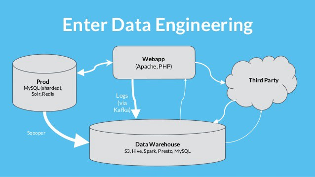
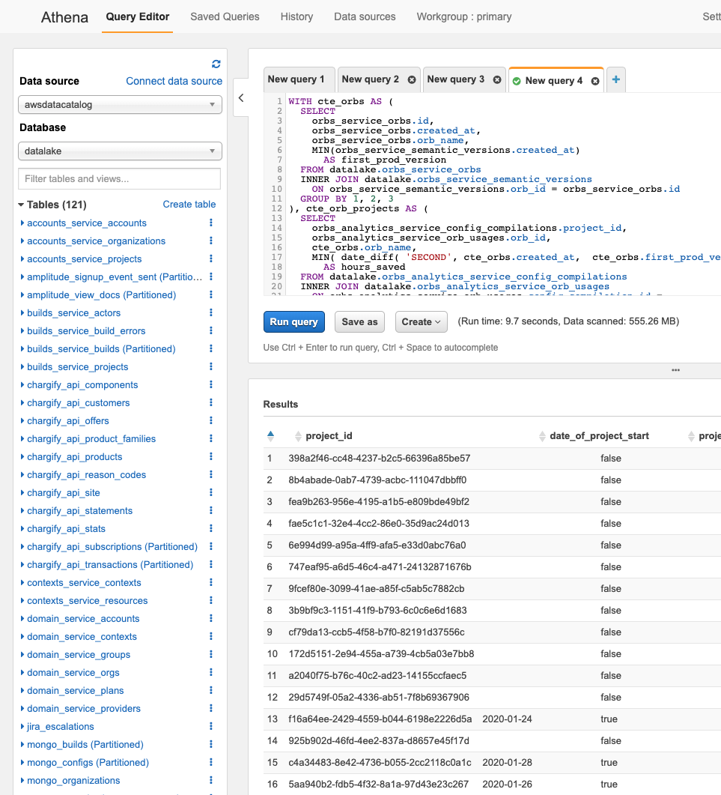
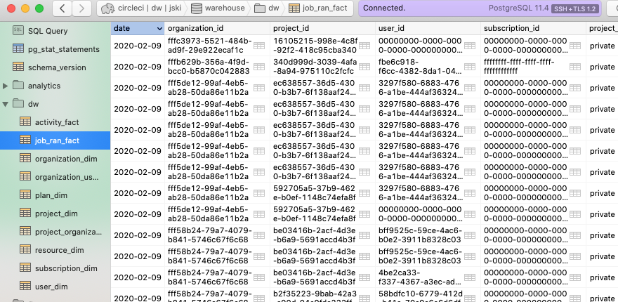
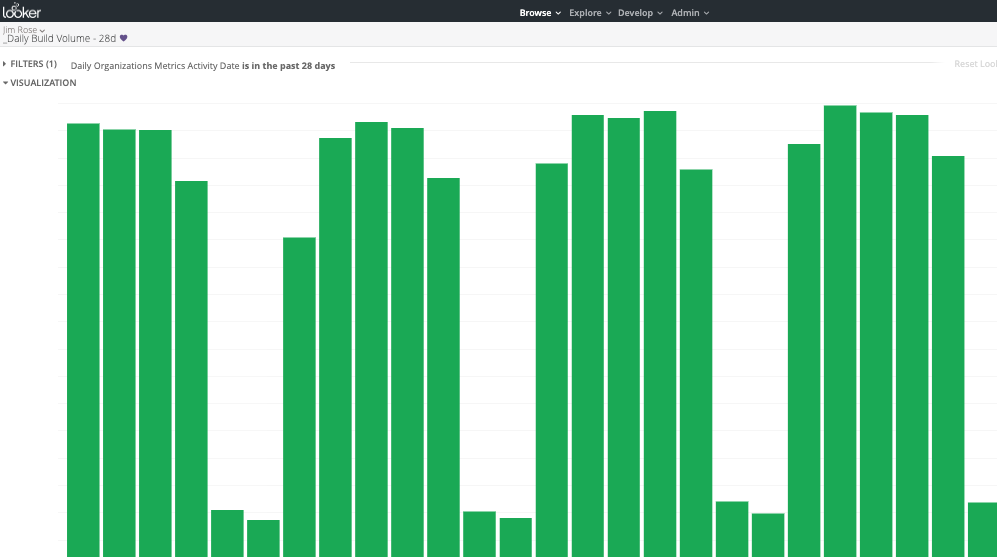

# Data Engineering

## Intro

What data engineers are, what they build, and why they are helpful to the organization

## What is it?

 

Data engineer is an engineer that focuses on building a data platform for data analysts and data scientists.

Specialized domain in databases, SQL, and organizational theory for how to best present the data.

Similarities:
	
	- code
	- testing
	- version control
	- CI/CD
	- gathering requirments, acceptance criteria
	- work organized in Kanban / agile style

Dissimilarities:

	- specialized domain focus on databases, SQL
	- specialized focus on organizational theory for how to best present the data
	- not focused web services
	- our customer is internal stakeholder, not external customer
	- fewer data engineers, because of the specialty

	
Data Engineers are:
	
	- engineers in the engineering organization
	- people who solve a company's data problems
	- make life easier for Data Analysts + Data Scientists (who answer business questions)

Data Engineering is NOT:

	- telling engineering teams how they should build their datastores
	- database administrators
	- frontline support for internal stakeholders
	- have specialized knowledge / insights of the company
	- good people to ask business questions of (data analysts, business analysts)
	- good people to ask to make graphs/charts


## Targets, Goals



### Platform

Where other people do work. Part of a value chain. Data engineering is not the entire value chain, just a part of it.

#### Upstream

This is where the data is produced and stored by other teams / services.

Production services

	mongo collections
	vms-service
	users-service
	accounts-service
	builds-service
	etc...
	
Vendor APIs
	
	stripe
	amplitude
	chargify
	etc...
	
Main goal of the system is to process one thing, many times.
	
Terminology:

	- OLTP (online transaction processing)
	- operational system
	- normalized (faster writes, slower reads, complex)
	


### Step 1, Make this data accessible

Put the data from the various services in one place to make it easier for the next step in the toolchain. 

In a cooking analogy, this is going to the various markets/stores and putting the food you need to cook into the refridgerator.

- datalake
	


### Step 2, Model the data, Reduce complexity, allow easy discovery/insights

Figure out logical combinations of data from the previous step, and make the data easier to understand. 

Main goal of the system is to process many things.

Terminology:

	- aggregations
	- OLAP (online analytical processing)
	- analytical system
	- fact/dimension tables
	- denormalized (slower writes, faster reads, simple)
	- ERD (enterprise resource diagram)

- data warehousing




### Downstream Users

Data engineers don't manage these things directly, but need to know what's happening downstream to build a better system

- visualization tools



## Methodologies


## How it works

Final product is a datawarehouse, most commonly accepted product design is called the Kimbal architecture, but there are other patterns out there as well. 

### Stack / Technologies

	Distributed systems: Presto (developed by Facebook), AWS Athena
	RDBMS: Postgres, SQL
	Scripting languages: Python, Clojure, Bash
	Deployments: Docker, Kubernetes
	CI: CircleCI

### Sample ETL, execution code:

```
#!/usr/bin/env bash

_date=''
task=''

usage(){
  echo "Usage: dw: ${0} [--task <mongo-dim-with-dependencies|fact-tables|...>]" 1>&2; exit 1
}
while [[ $# -gt 0 ]]; do
  case "$1" in
    -d|--date) _date="$2"; shift ;;
    -t|--task) task="$2"; shift ;;
    *) break ;;
  esac
  shift
done
if [[ -z $task ]]; then usage; fi

mongo_dim_tables(){
  if [[ ! -f ${tmp_dir}/mongo-organizations-transformed-users.csv ]]; then
    echo 'Dependent file not found!'

    "${dir}/dw/resolve-dependencies" --task mongo
  fi

  load 'load/dw/mongo-dim'
}

fact_tables(){
  local _date="$1"

  query_athena 'dw/activity-fact' "$_date" && \
    load 'load/dw/activity-fact-tables'

  query_athena 'dw/job-ran-fact' "$_date" && \
    load 'load/dw/job-ran-fact'
}

case "$task" in
  dim-tables )           mongo_dim_tables ;;
  fact-tables )          fact_tables "$_date" && \
                           "${dir}/dw/resolve-dependencies" --task ;;
  * ) echo 'In mongo and got no args' && exit 1 ;;
esac
```

### Sample ETL, load statement:

```
create temp table job_ran_fact_stage (
  date                       date not null,
  organization_analytics_id  uuid not null,
  project_analytics_id       uuid not null,
  user_analytics_id          uuid not null,
  project_visibility         dw.project_visibility_type not null,
  operating_system           dw.operating_system_type not null,
  outcome                    text not null,
  resource_class             text,
  executor                   dw.executor_type not null,
  subscription_id            uuid,
  dlc                        boolean not null,
  jobs_ran                   integer not null,
  credits_used               bigint,
  dlc_credits_used           bigint,
  minutes_used               numeric,

  primary key (date, organization_analytics_id, project_analytics_id, user_analytics_id, project_visibility, operating_system, outcome, resource_class, executor, dlc, subscription_id)
);

\copy job_ran_fact_stage  from '/tmp/dw-etl/dw/job-ran-fact.csv' with csv header;

create index on job_ran_fact_stage using hash (organization_analytics_id);

begin;

  with delete_unknowns_from_current_load_date as (
    select
      distinct(date) date
    from
      job_ran_fact_stage
  )
  delete
  from
    dw.job_ran_fact dw
  where
    date in ( select date from delete_unknowns_from_current_load_date )
    and (
      organization_id    = '00000000-0000-0000-0000-000000000000'
      or project_id      = '00000000-0000-0000-0000-000000000000'
      or user_id         = '00000000-0000-0000-0000-000000000000'
      or subscription_id = '00000000-0000-0000-0000-000000000000'
      or resource_id     = '00000000-0000-0000-0000-000000000000' )
    ;

  with stage_with_fk as (
    select
      stage.date,
      coalesce(organization_dim.id,'00000000-0000-0000-0000-000000000000') as organization_id,
      coalesce(project_dim.id,     '00000000-0000-0000-0000-000000000000') as project_id,
      coalesce(user_dim.id,        '00000000-0000-0000-0000-000000000000') as user_id,
      coalesce(resource_dim.id,    '00000000-0000-0000-0000-000000000000') as resource_id,
      stage.project_visibility,
      stage.outcome,
      stage.dlc,
      coalesce(subscription_dim.id,'00000000-0000-0000-0000-000000000000') as subscription_id,
      sum(stage.jobs_ran)                                                  as jobs_ran,
      sum(stage.credits_used)                                              as credits_used,
      sum(stage.dlc_credits_used)                                          as dlc_credits_used,
      sum(stage.minutes_used)                                              as minutes_used
    from
      job_ran_fact_stage stage
      left join dw.organization_dim          on organization_dim.analytics_id = stage.organization_analytics_id
      left join dw.project_dim                    on project_dim.analytics_id = stage.project_analytics_id
      left join dw.user_dim                          on user_dim.analytics_id = stage.user_analytics_id
      left join dw.subscription_dim on subscription_dim.zuora_service_plan_id = stage.subscription_id
      left join dw.resource_dim                on resource_dim.resource_class = stage.resource_class
                                            and resource_dim.operating_system = stage.operating_system
                                                    and resource_dim.executor = stage.executor
    group by
      1, 2, 3, 4, 5, 6, 7, 8, 9, 10, 11, 12
  )
  insert into dw.job_ran_fact (
    date,
    organization_id,
    project_id,
    user_id,
    resource_id,
    project_visibility,
    outcome,
    dlc,
    subscription_id,
    jobs_ran,
    credits_used,
    dlc_credits_used,
    minutes_used
  )
  select
    date,
    organization_id,
    project_id,
    user_id,
    resource_id,
    project_visibility,
    replace(replace(outcome,'[','{'), ']', '}')::dw.activity_outcome_status[],
    dlc,
    subscription_id,
    jobs_ran,
    credits_used,
    dlc_credits_used,
    minutes_used
  from
    stage_with_fk stage 
  on conflict (date, organization_id, project_id, user_id, subscription_id, resource_id, project_visibility, outcome, dlc) do update set
    jobs_ran                 = excluded.jobs_ran,
    credits_used             = excluded.credits_used,
    dlc_credits_used         = excluded.credits_used,
    minutes_used             = excluded.minutes_used,
    dw_updated_at            = now()
  ;

commit;

```

Start it like so:

```
src/dw-etl/dw/run-it --task fact-tables --date 2019-01-31
```

Logs:

```
CREATE TABLE
COPY 52553
CREATE INDEX
BEGIN
DELETE 25892
INSERT 0 51066
COMMIT
```

### Future of Data @ CircleCI

- Data warehouse, building a common & reusable set of fact + dimension tables
- improvements in workflow: migrations, automatic deployments, testing
- evolve towards a configuration-based approach
- faster data delivery


### Questions?