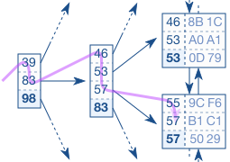

# Databases

## Why databases?

You could just use files, and glue together a unix pipeline for a search query.
However, difficult to reason about, a domain-specific language (SQL) is better.
SQL was not the first database language, actually there is an older one. Another
reason to use a database; is joining two files is very complicated. It must be
even moreso with more than two tables. Thus, the graph structure of how a
database system builds the execution nodes (scan, join, projection, selection,
etc) is very helpful. Finally, the files stored on disk can let's say use a CSV
serde. You can save additional space by having a binary table, with the schema
defined somewhere else not in the table.

## History

## Graph query language
[System R]

[Old technology]

[Relational algebra and set theory]

## How it works

Database tables are files stored in a binary-like format (like Avro or ORC)
that enforce schema. Schema is stored in the meta database.

Database execution happens by connecting a handful of plan nodes that implement
small parts of query execution.

Examples are:
- file scan node: scan a database file
- projection node: select only certain fields from the data passed in
- selection node: given a test, test the data passsed in. If test passes,
  return that field. If fails, drop that field
- sort node: sorts the data based on a sort criteria
- aggregation node: essentially, count, sum, and average all implemented
  identically, but output different information depending on the requested
  aggregation. Perform similar operations. Just like in order to average a
  column, you need to sum them up and count all of the records.
- nested loops join: join two sets of data based on a join condition. Least
  performant way of joining
- merge join: same as nested loops join, but more performant implementation.
  However, data must be sorted, which depending on size, could be expensive.
  Additionally, since almost guaranteed files will be larger than memory, an
  "out of core \[memory\] (core memory is older term for RAM)" strategy must be
  implemented.
- hash join: same as nested loops join, but a more performant implementation.
  Usually better than merge join, if one of the tables can fit into memory.

## Sorting, Hashing, and Single Table Queries

How does a database engine actually execute a basic query? This class attempts
to provide an intuition, focusing on queries over a single table.

Even to handle a query as simple as `select distinct email from users where age
> 18`, a DBMS implementer is immediately confronted by a number of interesting
questions:

How can the primary operations of this query—filtering records, mapping to a
single attribute and determining distinctness—be implemented in a modular
way?

What is an appropriate algorithm for something like distinct? Can we use
sorting or hashing to achieve this? Which is the better approach?  If our
records don’t entirely fit entirely into memory, how does that affect our
choice of algorithms?  We will see that a common architecture for a query
executor involves constructing a tree of iterator nodes, each with a standard
interface to lazily provide records to its parent as needed. We will also see
that out-of-core sorting and hashing algorithms are critical for a number of
operations, not just distinct but also explicit order by and group by clauses
and as the basis of two important join algorithms.

We will see that we prefer to call filtering to a subset of rows
“selection” and filtering to a subset of fields (or performing a similar
mapping, such as adding two fields together) “projection”. These terms derive
from the relational algebra, which we will explore in a later class.

## Joins
One of the fundamental challenges of information systems is to efficiently
answer questions regarding two or more separate collections of data at the same
time. In the context of database tables, this operation is called a join.

Three types of joins:

- Nested loops join
The most naive and typically slowest way to do a join. For every record of
table A, scan table B and find the records that fit the join condition.
Duplicative work here because you scan table B multiple times redundantly.

- Sort-merge join
First, sort the tables. Then, it is easy to loop through each record of table A
and find the records of table B that match table A. It combines two sorted
lists like a zipper.

- Hash join
The hash join aims for the weak spot of both nested loops join: many B-tree
traversals when executing the inner query (table B lookup).

The purpose of the hash table is to act as a temporary in-memory structure, to
avoid accessing the underlying table multiple times.

You try to get the hash table to fit into memory, and then stream the joining
table into memory, which works very fast.

- Other
One of the breakthroughs of joins in-general is called an out-of-core sort.
Normally for sorting algorithms (quick sort, mergesort, bubble sort), you have
the data in memory. However, for many database tables, you cannot fit the table
into memory as the tables are much larger than the RAM of the system. Thus, you
need to load pieces of the table (file) into RAM and store partial results on
disk and continue until the entire file is sorted. This is called out-of-core
stort.

## Indexes

An index is similar to an index or table of contents in a paper book. If you
are looking for a topic, you scan a much smaller piece of information to tell
you whereabouts in the larger piece of information where you can find the topic
you're after.

Implemented the same as tables, with a separate file.

- B+-tree index

When searching for a record, computer will start at root node. Each entry is
scanned in order until a value is found. It then follows the reference to the
corresponding branch node and repates the procedure until the tree traversal
reaches a leaf node. The search is very efficient as long as the tree is
balanced. It allows accessing all elements with the same number of steps; and
the index structure itself grows logarithmically compared to the underlying
record growth in the actual table. Real world indexes with millions of records
have a tree depth of four or five levels. This logarithmic growth is what makes
the search highly efficient.

However, the tradeoff is updating the index tree (and balancing it) is a slow
operation. Thus, it is an overoptimization and will cause unnecessary slow-down
to index on all columns on a table. Ideally, you just index on commonly-used
columns that are found in typical where-clause statements or join keys.

- Hash index

Clustered index
A clustered index is not really a separate index, it is when the physical table
itself is sorted a particular way. (Indexes are normally a separate
structure/table and are just information into a physical table).

Additionally, there are cases where the computer may not want to use the index
even when one exists. Query optimizer will determine if using an index is
necessary; and if multiple indexes on a table, which one the query optimizer
should use.

In order to have a query optimizer work effectively, need to have relatively
accurate table statistics. Table statistics don't need to be accurate, but
optimizer needs certain rough estimates of the table size and column value in
order to come up with the fastest plan.

## Relational Model and Query Optimization

The relational model, relational query languages and the underlying relational
algebra all serve as powerful tools for representing data.

They simplify the job that DBMS maintainers have of anticipating the needs of
users, and—importantly for our purposes—enables DBMS query planners to do a
remarkably good job of devising efficient plans. This class starts to explore
how, and has the primary objective of demystifying query optimization so as to
allow you to improve the efficiency of your own queries from first principles.

[more info]

## Query Parser

The query planner (or optimizer) is one of the most complex pieces of a DBMS,
estimated to take 50 person years of work to complete. The goal of this
exercise isn’t to give you a detailed understanding of what a query planner
looks like in a real system, so much as to ensure that this piece isn’t
entirely absent from your mental picture.

[Using statistics to make a best-guess of a query plan.]

[how you take SQL and turn it into plan nodes]

## Logging for Atomicity and Durability
In order to be ACID compliant, we need to use a write-ahead log (WAL).

## Acid
ACID stands for atomicity, consistency, isolation, and durability. ACID is
implemented through the use of transactions.

- Atomicity
Atomicity guarantees that each transaction is treated as a single unit, and
each statement in the transaction either all completes successfully or all
fails to complete. Nothing in between, it either all worked or it all didn't
work. As a result, the transaction can/should not be observed to be in progress
by another database client- multiple operations should be though of happening
at exactly the same time.

- Consistency
Consistency means a traansaction can only bring the database from one valid
state to another. IE, referential integrity is maintained.

- Isolation (described in further detail below)
Transactions are often executed concurrently (appearing to happen at the same
time). Isolation ensures the concurrent execution of transactions leave the
database in the same state that would have been obtained were the transactions
to be executed sequentially. The main goal of isolation is concurrency control.

- Durability
Guarantee that once a transaction has been committed, it will remain committed,
even in the case of a system failure (crash or power outage). This usually
means a transaction is written to the WAL before returned successful to the
user/client.

## Transaction/Isolation levels / Concurrency
Dirty reads: ability to see not-yet-committed changes made by other
transactions.
Phantom reads: in the course of a transaction, new rows are added or removed by
another transaction to the records being read. In other words: conceptually,
transaction is supposed to give you a snapshot-in-time. However, depending on
your priority of transaction isolation levels, you may have phantom reads (see
things you shouldn't have). The tradeoff here is: the higher the isolation
level, the more queries are blocked waiting on the higher isolation level
transaction to finish. But, the lower the isolation level, the faster things
are, but there is a possibility of losing this "snapshot-in-time" way of
thinking about transactions.

- Read Uncommited
Dirty reads: possible
Phantom reads: possible

In postgres, it is not possible to get to this isolation level. The SQL
standard specifies a READ UNCOMMITTED statement, but postgres will bump you up
to the READ COMMITTED isolation level.

Also, it is possible to see not-yet-committed changes.

This is the fastest/best performant transaction level.

- Read commited
Dirty reads: not possible
Phantom reads: possible

When you specify a TRANSACTION clause, this is the isolation level you get.

This allows you to only see rows that were committed before the transaction
began.

- Repeatable read
Dirty reads: not possible
Phantom reads: possible

With this, all statements of the current transaction can only see rows
committed before the first query/data modification statement was executed.

- Serializable
Dirty reads: not possible
Phantom reads: not possible

Here, you get all the benefits of the prior isolation levels. However,
additionally, you also get coverage for this case: if a pattern of reads or
writes among current serializable transactions would create a situation which
could not have occurred for any serial (one-at-a-time) execution of those
transactions, one of them will be rolled back.

This is the slowest isolation level. It will block other transactions trying to
access the shared resource (the underlying table). Think of it as a database
can serve concurrent requests easily- but when you go serializable, you force
it to be one-at-a-time in order to ensure good data.

## Distributed Databases
There are plenty of other non-RDBMS, like Mongo, Redis, Memcache, Dynamo etc.
Dynamo in particular is a very interesting / complex system that deals with
having a cluster.

There are also database-adjacent systems like hadoop + hive, or presto.

## Replication
Replication happens when a primary database ships its WAL entries to another
database; the physical changes are not transported; only the diffs to the
underlying tuples. Thus, in order for replication to work, the primary and
secondary databases need to start from the same point of time.
