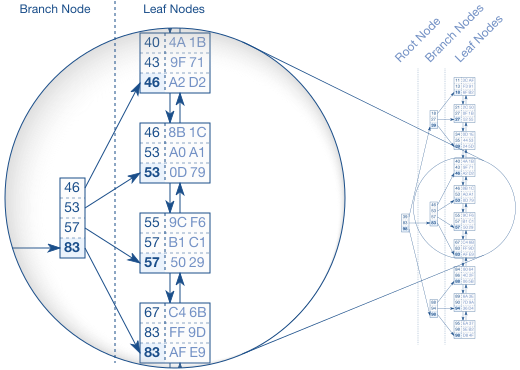

# Databases

### History

Graph query language

Old technology

Relational algebra and set theory

## How it works

Database tables are files stored in a binary-like format (like Avro or ORC)
that enforce schema. Schema is stored in the meta database.

Database execution happens by connecting a handful of plan nodes that implement
small parts of query execution.

Examples are:
- file scan node: scan a database file
- projection node: select only certain fields from the data passed in
- selection node: given a test, test the data passsed in. If test passes,
  return that field. If fails, drop that field
- sort node: sorts the data based on a sort criteria
- aggregation node: essentially, count, sum, and average all implemented
  identically, but output different information depending on the requested
  aggregation. Perform similar operations. Just like in order to average a
  column, you need to sum them up and count all of the records.
- nested loops join: join two sets of data based on a join condition. Least
  performant way of joining
- merge join: same as nested loops join, but more performant implementation.
  However, data must be sorted, which depending on size, could be expensive.
  Additionally, since almost guaranteed files will be larger than memory, an
  "out of core \[memory\] (core memory is older term for RAM)" strategy must be
  implemented.
- hash join: same as nested loops join, but a more performant implementation.
  Usually better than merge join, if one of the tables can fit into memory.

## Sorting, Hashing, and Single Table Queries

## Joins
One of the fundamental challenges of information systems is to efficiently
answer questions regarding two or more separate collections of data at the same
time. In the context of database tables, this operation is called a join.

Three types of joins:

- Nested loops join
The most naive and typically slowest way to do a join. For every record of
table A, scan table B and find the records that fit the join condition.
Duplicative work here because you scan table B multiple times redundantly.

- Sort-merge join
First, sort the tables. Then, it is easy to loop through each record of table A
and find the records of table B that match table A. It combines two sorted
lists like a zipper.

- Hash join
The hash join aims for the weak spot of both nested loops join: many B-tree
traversals when executing the inner query (table B lookup).

- Other
One of the breakthroughs of joins in-general is called an out-of-core sort

## Indexes

An index is similar to an index or table of contents in a paper book. If you
are looking for a topic, you scan a much smaller piece of information to tell
you whereabouts in the larger piece of information where you can find the topic
you're after.

Implemented the same as tables, with a separate file.

Levels of an index
-

- B+-tree index

When searching for a record, computer will start at root node. Each entry is
scanned in order until a value is found. It then follows the reference to the
corresponding branch node and repates the procedure until the tree traversal
reaches a leaf node. The search is very efficient as long as the tree is
balanced. It allows accessing all elements with the same number of steps; and
the index structure itself grows logarithmically compared to the underlying
record growth in the actual table. Real world indexes with millions of records
have a tree depth of four or five levels. This logarithmic growth is what makes
the search highly efficient.

However, the tradeoff is updating the index tree (and balancing it) is a slow
operation. Thus, it is an overoptimization and will cause unnecessary slow-down
to index on all columns on a table. Ideally, you just index on commonly-used
columns that are found in typical where-clause statements or join keys.

- Hash index

Clustered index
A clustered index is not really a separate index, it is when the physical table
itself is sorted a particular way. (Indexes are normally a separate
structure/table and are just information into a physical table).

Additionally, there are cases where the computer may not want to use the index
even when one exists. Query optimizer will determine if using an index is
necessary; and if multiple indexes on a table, which one the query optimizer
should use.

In order to have a query optimizer work effectively, need to have relatively
accurate table statistics. Table statistics don't need to be accurate, but
optimizer needs certain rough estimates of the table size and column value in
order to come up with the fastest plan.

## Relational Model and Query Optimization

## Query Parser

## Logging for Atomicity and Durability
In order to be ACID compliant, we need to use a write-ahead log (WAL).

## Acid
ACID stands for atomicity, consistency, isolation, and durability. ACID is
implemented through the use of transactions.

## Transaction/Isolation levels
- Read Uncommited
Dirty reads: possible
Phantom reads: possible

The lowest level, this is the default for postgres (you don't need to even
specify a TRANSACTION clause).

Also, it is possible to see not-yet-committed changes.

- Read commited
Dirty reads: not possible
Phantom reads: possible

- Repeatable read
Dirty reads: not possible
Phantom reads: possible

- Serializable
Dirty reads: not possible
Phantom reads: not possible

## Concurrency

## Distributed Databases

## Replication
Replication happens when a primary database ships its WAL entries to another
database; the physical changes are not transported; only the diffs to the
underlying tuples. Thus, in order for replication to work, the primary and
secondary databases need to start from the same point of time.
