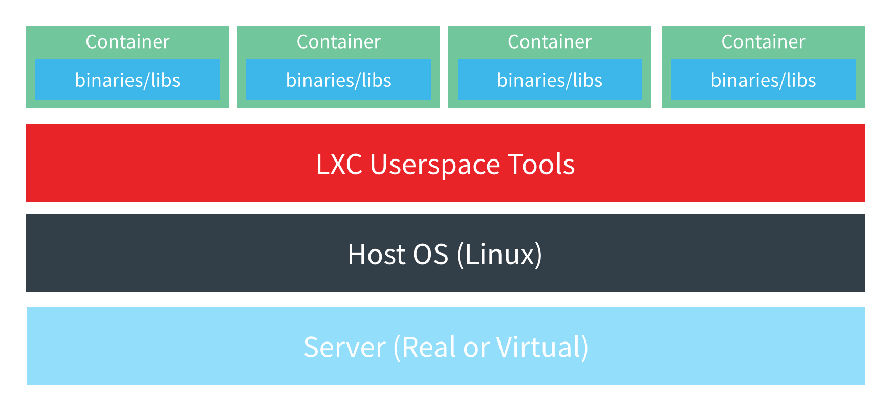
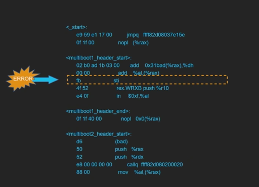
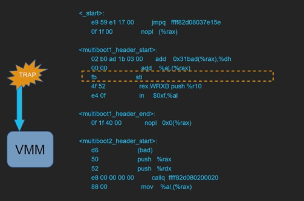
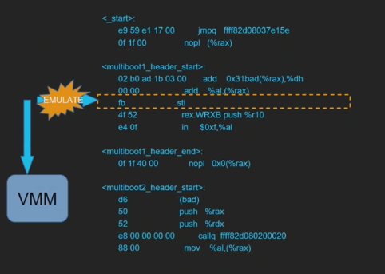
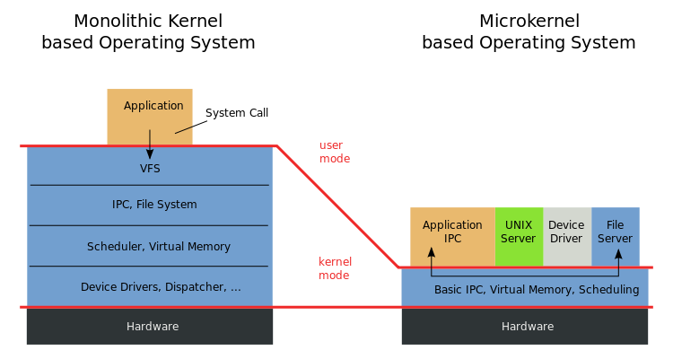
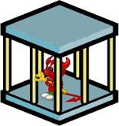
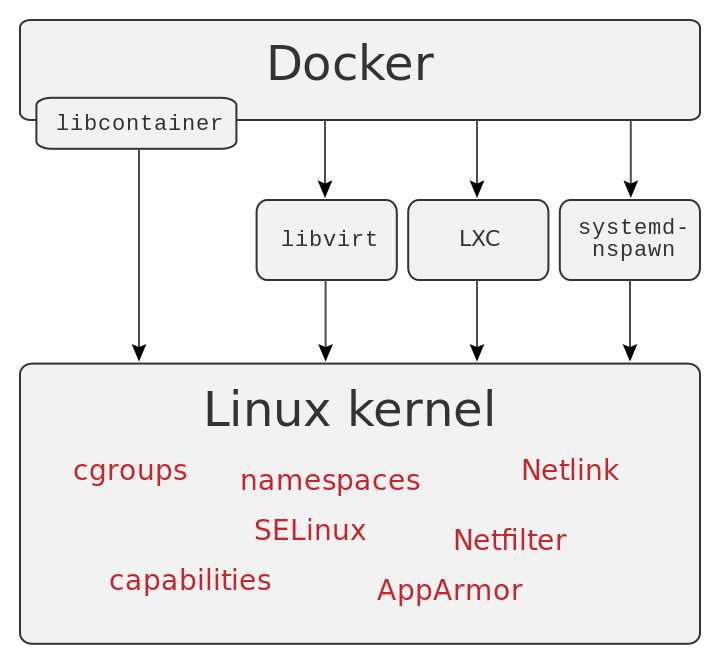
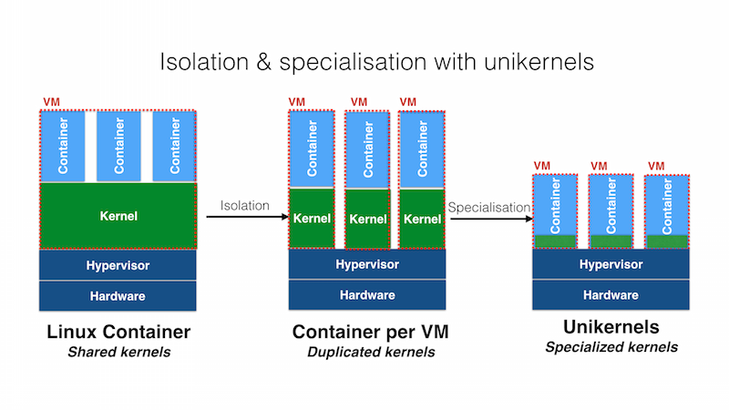

## docker: what's under the hood?


Docker has taken its place in developers' workflow. Many articles exist on what
Docker is and how to start using it. I aim to explain here the details of how
the technology works.

### docker features
One of the most important features in a Docker container versus a virtual
machine is Docker's instant startup time. Within miliseconds, the Docker
container and application can be started; as opposed to waiting for a virtual
machine to boot. Docker does this by not actually using a virtual machine to
simulate a virtual machine. Docker piggybacks off of features in the Linux
kernel, to perfom its magic. Because of this reliance on the Linux kernel, it
is important to note that Docker *only* runs on Linux. For instance, if you
develop on an Apple computer (Darwin kernel - which is based on a BSD kernel -
which is not Linux), you need to install and run a lightweight Linux virtual
machine before being able to use Docker.

### docker virtualization vs other virtualization strategies
Once you are familiar with the underlying technologies, Docker seems less
mystical.  In fact, Docker only works with the Linux kernel, so it's not really
a virtual machine as much as it is simulating various Linux distributions,
environments or installs. (Did you know that, if you wanted to, you could take
an Ubuntu distribution and install/remove software until it looks and feels
like another distribution, such as Gentoo? It's all just using the Linux kernel
- various distros are just different userland / package managers on top of the
  Linux kernel!).

Let's take a step back. Operating systems are software that run on hardware.
An operating system was orignally called a "supervisor", which is a fantastic
analogy what the operating system is doing. Think of the operating system as a
referee or parent, watching over the other programs. The operating system lets
other programs run, and coordinates the scheduling and execution of those
programs.  Remember, back in the old days, computers could only do one thing at
a time.  Actually, that's still true (a single processor can only do one thing
at a time - let's save pipelining, multiple cores, and hyperthreading for
another article), and it's the operating system that is context switching back
and forth very quickly that gives the appearance of multiple programs running
at the same time.

#### what is virtualization?



Virtualization is the act of creating a virtual version of something, rather
than an actual version of that something. Let's talk about virtualizing a
processor.  A processor, when running a program, runs machine languages
(compiled assembly code). Assembly languages and machine languages need to
conform to the processor's instruction set, so an Intel processor will run x86
machine language, and your iPhone will run ARM machine language.

What happens if we were to run an x86 program on an ARM processor? Skipping
over many, many details, a simplified example can be thus:



The x86 instruction, `sti`, or set interrupt flag (in hex, fb), is not
understood by the ARM processor. Normally this would result in a crash.



However, the processor could trap particular errors - ala, if you see something
like this, go shuffle it off somewhere. In this case, trap the error and send
the instruction to the Virtual Machine Manager.



The Virtual Machine Manager knows how to emulate the `sti` instruction - and
now we can continue along in the program.

#### full virtualization: QEMU
QEMU (quick emulator) is software that performs hardware virtualization. QEMU
emulates CPUs through dynamic binary translation and provides device models;
letting it run on unmodified host operating systems. Downsides: it's very slow,
instructions need to be mapped from one instruction set to another (translating
the x86 `sti` [Set Interrupt Flag] would need to be mapped into many different
ARM instructions).

#### hardware-assisted virtualization (intel virtualization technology)
Operating systems run in privileged mode to access drivers. Linux kernel has
special instructions that are meant to run in that privileged mode. If run as
an application, the instruction will error. The idea is to trap execution calls
and send them to the virtualization system. This is very slow - goal is have
most calls run natively, and only trap/VMM a small subset of calls.

Hardware-assisted virtualization first appeared in an IMB System/370 in 1972!
If you're on an Intel / AMD x86 CPU purchased in the past 10 years, you have
it! Intel added this technology in 2005.

#### paravirtualization: xen hypervisor
Applications will often make system calls - such as listening to a network
socket, or reading a file. These are privileged system calls that only the
kernel can make. The kernel will then often use a driver to perform the
requested system call, and give the information back to the application.

The xen hypervisor is like an operating system of operating systems. It uses a
microkernel design, interacts with guests (such as Ubuntu, or Debian Linux) via
dom0 (or the Xen hypervisor) over a "hypercall" (vs system call) using an ABI
(application binary interface) (vs API). So an application running inside a
virtualized Ubuntu operating system will make a system call for a file to be
opened and read, which will then be sent to Xen as a hypercall, which then Xen
will use the driver to open and read the file from the harddrive (simplified
example).



#### other operating system level virtualization: FreeBSD jails



Ideologically, FreeBSD Jails are very similar to Docker. FreeBSD jails were
first introduced in 2000, long before LXC containers (2008) or Docker (2013)
were first released.

Jails are a BSD userland software to run on top of chroot(2) system call, which
came before Docker and are very similar to Docker.

> Since system administration is a difficult task, many tools have been
> developed to make life easier for the administrator. These tools often
> enhance the way systems are installed, configured, and maintained. One of the
> tools which can be used to enhance the security of a FreeBSD system is jails.
> Jails have been available since FreeBSD 4.X and continue to be enhanced in
> their usefulness, performance, reliability, and security.
> -- FreeBSD Handbook, Chapter 14. Jails

### tools & terminology
There are several tools to using docker. The Docker client is `docker`, which
most of your commands will be run using. There is also `docker-machine`, which
is a wrapper on OS X to help set up the lightweight Linux virtual machine to
execute to `docker` commands inside of.

A Docker image is an artifact. It is created by running the `docker build`
command on a given Dockerfile (the script used to create a docker image). A
Docker container is a run-time instance of a Docker file. An analogy might be:
Docker image is to a `.jar` file as a Docker container is to a running process
of that `.jar`.

A docker container is the execution environment for an image. It is the
runnable version of an image, and is written/run on your filesystem.

Artifacts (Docker images) can be stored on private or public repositories
called registries. Some common registries are Docker Hub, quay.io, and AWS ECR.

### technology



#### cgropus & namespaces
The backbone of the Docker technology are `cgroups` (short for control groups)
and kernel namespaces, both of which are features already provided in the Linux
kernel. With cgroups, the Linux operating system can easily manage and monitor
resource allocation for a given process, and set resource limits, like CPU,
memory, and network limits. The kernel can now control the maximum amount of
resources a prcoess gets. This lets the Docker engine only give out 50% of the
computer's memory, 50% of processors, 50% of network, etc. to a running Docker
container. Namespaces are helpful in isolating process groups from each other.
There are six namespaces in Linux: `mnt`, `IPC`, `net`, `usr`, `pid`, `uts`).
Each container will have its own namespace and processes running inside that
namespace, and will not have access to anything outside its namespace.

Docker containers also have network isolation (via `libnetwork`), geting
separate virtual interfaces and IP addressing between containers.

#### union file system
Docker uses union filesystem to create and layer Docker images. This means all
images are done to a base image, and then actions added to that base image (ie:
`RUN apt install curl` to create a new image. Under the hood, it allows files
and directories of seperate file systems (known as branches), to be
transparently overlaid, forming a single coherent file system. When branch
contents have the same directory, the contents are merged and seen together in
a single merged directory, and if branches contain the same file, a branch
priority is specified, with the priority branch's file succeeding.

Docker, when building an image, will save these branches in its cache. A
benefit is, if Docker detects the command to create a branch (or layer) already
exist in its cache, it will re-use the branch and not run the command (a cache
hit). This is known as docker layer caching.

#### libcontainer
The C library that provides the underlying Docker functionality is called
`libcontainer`, or now known as `runC`.  For each execution, each container
gets its own root filesystem (`/tmp/docker/[uuid]/`), and the underlying host
does not let the process leave that directory (called a `chroot jail` - a quick
rundown: one of the variables that a process gets when started by the operating
system is current working directory - a `chroot jail` is where the operating
system prevents that started process from accessing a parent directory, such as
`../`).

### faking it: udocker
One of the drawbacks of Docker is that the Docker engine requires root
privileges to run containers. However, an open source project, `udocker`,
provides the same basic functionality the Docker engine does without root
privileges.

It works by creating a `chroot`-like environment over the extracted container,
and using various implementation strategies, to mimic chroot execution with
just user-level privileges. One of the execution environments that is an option
for you to use is actually `runC`, the same one used by Docker.

For instance, image the following script:

```
#!/usr/bin/env bash
set -eou pipefail

if [[ ! -d ~/bin ]]; mkdir ~/bin; fi
PATH="${PATH}:~/bin"

curl \
  https://raw.githubusercontent.com/skilbjo/lambdas/master/iris/resources/udocker \
  >./udocker \
  && chmod 744 udocker \
  && mv ./udocker ~/bin

udocker install
udocker pull quay.io/skilbjo/iris:x86-debian   # pull down image from docker repo
udocker create --name=_ quay.io/skilbjo/iris:x86  # 'create' a container / unpack the image
udocker setup --execmode=F1 _  # set the execution engine
udocker run \
  --nosysdirs \
  _ \
  /bin/bash -c 'echo "hello from inside udocker!"'
```

will return:

```bash
Warning: running as uid 0 is not supported by this engine
Warning: non-existing user will be created

##############################################################################
# #
# STARTING e7818ced-28b7-3bb5-9bdf-c8586cf6ae3c #
# #
##############################################################################
executing: bash
hello from inside udocker!
done!
```


### the future: unikernels
Take a step back: much of the internet runs inside AWS data centers,
virtualizing machines known as EC2. We then run Docker containers on top of
that. The end result is many different middlware layers before the application
can get access to the processor. The idea behind unikernels is to strip out
much of the kernel and unnecessary software (since an operating system is meant
to be generic, and do many different things) to be able to just run the
application. If the application doesn't need network, then no network drivers
or kernel code is included in the kernel.

Three years ago, Docker acquired a company called Unikernel Systems to
potentially build out this concept, as one of Docker's (the company) is to
provide high-quality tools and doucmentation for developing software on their
platform.



### sources
- <https://docs.docker.com/engine/docker-overview/#docker-engine>
- <https://github.com/skilbjo/articles/blob/master/talks/free_bsd_jails.md>
- <https://stackoverflow.com/questions/16047306/how-is-docker-different-from-a-virtual-machine>
- <https://devopscube.com/what-is-docker/>
- <https://elinux.org/images/5/57/Elc2013_Edge.pdf>
- <https://en.wikipedia.org/wiki/Docker_(software)>
- <https://github.com/moby/moby> (Docker source code)
- <https://github.com/docker/engine/blob/master/daemon/daemon.go>
- <https://books.google.com/books?id=4xQKBAAAQBAJ>
- <https://wxdublin.gitbooks.io/docker-code-walk/content/daemon.html>
- <https://www.itworld.com/article/2698646/virtualization/containers-bring-a-skinny-new-world-of-virtualization-to-linux.html>
- <https://www.youtube.com/watch?v=LabltEXk0VQ>
- <https://github.com/indigo-dc/udocker>
