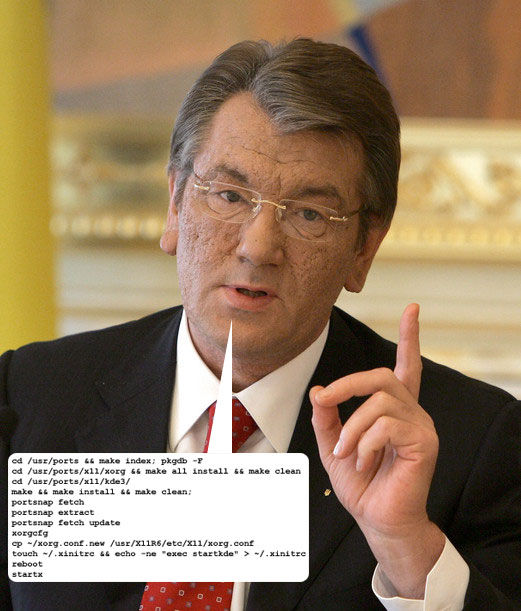

# free-bsd jails

## BSD


See more in my talk about [Unix](./unix.md).

Berkeley Software Distribution, Berkeley Unix, or BSD, is a Unix-like operating
system, probably the closest surviving relative of original UNIX. It shared the
initial codebase and design with the original AT&T Unix operating system.

The original BSD (386BSD, called Jolix) was forked in 1993 into came derivative
operating systems: FreeBSD and NetBSD. OpenBSD was then forked from NetBSD in 1995,
and DragonFlyBSD forked from FreeBSD in 2003.

Note: Linux and the various distributions (Arch Linux, Alpine Linux, Debian) all
share the same kernel. Kernel land and userland are worked on independently in
releases (ie. Linux 3.4 + Alpine Linux 3.5 & Linux 3.4 & Arch Linux LATEST would
look & feel different to the user even though they share the same kernel), and
the distros rely on the kernel independently of the userland. With BSDs, the
kernel and userland are often in the same version control system; there is no
shared BSD kernel FreeBSD and NetBSD, as they use their own kernel. However,
occassionally developers will release userland operating systems on top of a \*BSD
kernel, such as Debian GNU/kNetBSD on top of the NetBSD kernel, or Orbis OS
{runs the Playstation 4} on top of the FreeBSD kernel.

Note: Apple's iOS and macOS along with the Darwin kernel include a large amount
of code derived from FreeBSD.



## Jails
### Why?
> Since system administration is a difficult task, many tools have been developed
> to make life easier for the administrator. These tools often enhance the way
> systems are installed, configured, and maintained. One of the tools which can
> be used to enhance the security of a FreeBSD system is jails. Jails have been
> available since FreeBSD 4.X and continue to be enhanced in their usefulness,
> performance, reliability, and security.

Jails are userland software to run on top of chroot(2) system call, in the
`#include <unistd.h>` library.

```
CHROOT(2)     FreeBSD System Calls Manual        CHROOT(2)

DESCRIPTION
     The dirname argument is the address of the pathname of a directory, ter-
     minated by an ASCII NUL.  The chroot() system call causes dirname to
     become the root directory, that is, the starting point for path searches
     of pathnames beginning with `/'.

     In order for a directory to become the root directory a process must have
     execute (search) access for that directory.

     It should be noted that chroot() has no effect on the process's current
     directory.

     This call is restricted to the super-user.

     Depending on the setting of the `kern.chroot_allow_open_directories'
     sysctl variable, open filedescriptors which reference directories will
     make the chroot() fail as follows:

     If `kern.chroot_allow_open_directories' is set to zero, chroot() will
     always fail with EPERM if there are any directories open.

     If `kern.chroot_allow_open_directories' is set to one (the default),
     chroot() will fail with EPERM if there are any directories open and the
     process is already subject to the chroot() system call.

     Any other value for `kern.chroot_allow_open_directories' will bypass the
     check for open directories
```

Why virtualize? Primarily, so the app will run, damnit. "Write once, run anywhere"
concept. As long as the developer packages the app initially in a virtualization
software, the contract is the app will work.


## jails demo

```bash
Last login: Mon Feb 12 01:03:32 2018 from 10.8.0.10
FreeBSD 11.1-RELEASE-p1 (GENERIC) #0: Wed Aug  9 11:55:48 UTC 2017

Welcome to FreeBSD!

Release Notes, Errata: https://www.FreeBSD.org/releases/
Security Advisories:   https://www.FreeBSD.org/security/
FreeBSD Handbook:      https://www.FreeBSD.org/handbook/
FreeBSD FAQ:           https://www.FreeBSD.org/faq/
Questions List: https://lists.FreeBSD.org/mailman/listinfo/freebsd-questions/
FreeBSD Forums:        https://forums.FreeBSD.org/

Documents installed with the system are in the /usr/local/share/doc/freebsd/
directory, or can be installed later with:  pkg install en-freebsd-doc
For other languages, replace "en" with a language code like de or fr.

Show the version of FreeBSD installed:  freebsd-version ; uname -a
Please include that output and any error messages when posting questions.
Introduction to manual pages:  man man
FreeBSD directory layout:      man hier

Edit /etc/motd to change this login announcement.

 * keychain 2.8.3 ~ http://www.funtoo.org
 * Found existing ssh-agent: 924
 * Known ssh key: /home/skilbjo/.ssh/id_rsa

By pressing "Scroll Lock" you can use the arrow keys to scroll backward
through the console output.  Press "Scroll Lock" again to turn it off.
@udoo:~ $ which ezjail
@udoo:~ $ cd /usr/ports/sysutils/ezjail/
@udoo:ezjail $ make install clean
===>   ezjail-3.4.2 depends on file: /usr/local/sbin/pkg - found
=> ezjail-3.4.2.tar.bz2 doesn't seem to exist in /usr/ports/distfiles/.
=> Attempting to fetch http://erdgeist.org/arts/software/ezjail/ezjail-3.4.2.tar.bz2
ezjail-3.4.2.tar.bz2                          100% of   37 kB  110 kBps 00m01s
===> Fetching all distfiles required by ezjail-3.4.2 for building
===>  Extracting for ezjail-3.4.2
=> SHA256 Checksum OK for ezjail-3.4.2.tar.bz2.
===>  Patching for ezjail-3.4.2
===>  Configuring for ezjail-3.4.2
===>  Building for ezjail-3.4.2
===>  Staging for ezjail-3.4.2
===>   Generating temporary packing list
mkdir -p /usr/ports/sysutils/ezjail/work/stage/usr/local/etc/ezjail/ /usr/ports/sysutils/ezjail/work/stage/usr/local/man/man5/ /usr/ports/sysutils/ezjail/work/stage/usr/local/man/man7 /usr/ports/sysutils/ezjail/work/stage/usr/local/man/man8 /usr/ports/sysutils/ezjail/work/stage/usr/local/etc/rc.d/ /usr/ports/sysutils/ezjail/work/stage/usr/local/bin/ /usr/ports/sysutils/ezjail/work/stage/usr/local/share/examples/ezjail /usr/ports/sysutils/ezjail/work/stage/usr/local/share/zsh/site-functions
cp -R examples/example /usr/ports/sysutils/ezjail/work/stage/usr/local/share/examples/ezjail/
cp -R examples/nullmailer-example /usr/ports/sysutils/ezjail/work/stage/usr/local/share/examples/ezjail/
cp -R share/zsh/site-functions/ /usr/ports/sysutils/ezjail/work/stage/usr/local/share/zsh/site-functions/
sed s:EZJAIL_PREFIX:/usr/local: ezjail.conf.sample > /usr/ports/sysutils/ezjail/work/stage/usr/local/etc/ezjail.conf.sample
sed s:EZJAIL_PREFIX:/usr/local: ezjail.sh > /usr/ports/sysutils/ezjail/work/stage/usr/local/etc/rc.d/ezjail
sed s:EZJAIL_PREFIX:/usr/local: ezjail-admin > /usr/ports/sysutils/ezjail/work/stage/usr/local/bin/ezjail-admin
sed s:EZJAIL_PREFIX:/usr/local: man8/ezjail-admin.8 > /usr/ports/sysutils/ezjail/work/stage/usr/local/man/man8/ezjail-admin.8
sed s:EZJAIL_PREFIX:/usr/local: man5/ezjail.conf.5 > /usr/ports/sysutils/ezjail/work/stage/usr/local/man/man5/ezjail.conf.5
sed s:EZJAIL_PREFIX:/usr/local: man7/ezjail.7 > /usr/ports/sysutils/ezjail/work/stage/usr/local/man/man7/ezjail.7
chmod 755 /usr/ports/sysutils/ezjail/work/stage/usr/local/etc/rc.d/ezjail /usr/ports/sysutils/ezjail/work/stage/usr/local/bin/ezjail-admin
chmod 0440 /usr/ports/sysutils/ezjail/work/stage/usr/local/share/examples/ezjail/example/usr/local/etc/sudoers
====> Compressing man pages (compress-man)
===>  Installing for ezjail-3.4.2
===>  Checking if ezjail already installed
===>   Registering installation for ezjail-3.4.2
Installing ezjail-3.4.2...
===>  Cleaning for ezjail-3.4.2

@udoo:ezjail $ which ezjail-admin
/usr/local/bin/ezjail-admin

@udoo:~ $ sudo ezjail-admin install -sp

@udoo:~ $ ifconfig
re0: flags=8843<UP,BROADCAST,RUNNING,SIMPLEX,MULTICAST> metric 0 mtu 1500
        options=8209b<RXCSUM,TXCSUM,VLAN_MTU,VLAN_HWTAGGING,VLAN_HWCSUM,WOL_MAGIC,LINKSTATE>
        ether 00:00:00:00:00:00
        hwaddr 00:00:00:00:00:00
        inet 192.168.2.49 netmask 0xffffff00 broadcast 192.168.2.255
        nd6 options=29<PERFORMNUD,IFDISABLED,AUTO_LINKLOCAL>
        media: Ethernet autoselect (1000baseT <full-duplex>)
        status: active
vboxnet0: flags=8943<UP,BROADCAST,RUNNING,PROMISC,SIMPLEX,MULTICAST> metric 0 mtu 1500
        ether 00:00:00:00:00:00
        hwaddr 00:00:00:00:00:00
        inet 10.2.1.1 netmask 0xffffff00 broadcast 10.2.1.255
        nd6 options=29<PERFORMNUD,IFDISABLED,AUTO_LINKLOCAL>
        media: Ethernet autoselect
        status: active
VBoxManage hostonlyif ipconfig vboxnet0 --ip 192.168.99.100 --netmask 192.168.99.255
VBoxManage hostonlyif ipconfig vboxnet0 --ip 192.168.99.100 --netmask 255.255.255.0
VBoxManage hostonlyif ipconfig vboxnet0 --ip 192.168.99.100 --netmask 255.255.255.0
 61                             [--paravirtdebug <key=value> [,<key=value> ...]]_                          │@udoo:~ $ VBoxManage showvminfo "default" | grep -i nic
 62                             [--hwvirtex on|off]_                                                       │NIC 1:           MAC: 080027688C11, Attachment: NAT, Cable connected: on, Trace: off (file: none), Type: 82540EM, Reported speed: 0 Mbps, Boot priority: 0, Promisc Policy: de
 63                             [--nestedpaging on|off]_                                                   │ny, Bandwidth group: none
 64                             [--largepages on|off]_                                                     │NIC 1 Settings:  MTU: 0, Socket (send: 64, receive: 64), TCP Window (send:64, receive: 64)
 65                             [--vtxvpid on|off]_                                                        │NIC 1 Rule(0):   name = ssh, protocol = tcp, host ip = 127.0.0.1, host port = 20731, guest ip = , guest port = 22
 66                             [--vtxux on|off]_                                                          │NIC 1 Rule(1):   name = tcp-port8080, protocol = tcp, host ip = , host port = 8080, guest ip = , guest port = 8080
 67                             [--pae on|off]_                                                            │NIC 1 Rule(2):   name = tcp-port8443, protocol = tcp, host ip = , host port = 8443, guest ip = , guest port = 8443
 68                             [--longmode on|off]_                                                       │NIC 2:           MAC: 080027A6B04F, Attachment: Host-only Interface 'vboxnet0', Cable connected: on, Trace: off (file: none), Type: 82540EM, Reported speed: 0 Mbps, Boot prio
 69                             [--cpu-profile "host|Intel 80[86|286|386]"]_                               │rity: 0, Promisc Policy: deny, Bandwidth group: none
 70                             [--cpuid-portability-level <0..3>_                                         │NIC 3:           disabled


@udoo:~ $ sudo ifconfig em0 alias 192.168.99.100 netmask 0xffffff00 broadcast 192.168.99.255
@udoo:~ $ sudo echo 'ifconfig_em0_alias0="inet 192.168.99.100 netmask 0xffffff00 broadcast 192.168.99.255"' >> /etc/rc.conf
@udoo:~ $ sudo echo 'ezjail_enable="YES"' >> /etc/rc.conf

@udoo:~ $ sudo ezjail-admin create jails.bsd 192.168.99.100
@udoo:~ $ sudo cp /etc/resolv.conf /usr/jails/jails.bsd/etc/
@udoo:~ $ sudo service ezjail start

jls


@udoo:~ $ sudo ezjail-admin console bsdnow.tv

Last login: Sun Dec 29 03:08:29 on pts/17
FreeBSD 9.2-RELEASE (GENERIC) #0 r255898: Fri Sep 27 03:52:52 UTC 2013

Welcome to FreeBSD!

exit

@udoo:~ $ sudo ezjail-admin stop bsdnow.tv
@udoo:~ $ sudo ezjail-admin archive bsdnow.tv


```

## Other virtualization technologies
### Full virtualization
#### qemu

### Hardware-assisted virtualization
The idea here is to trap execution calls and send them to the virtualization system.

Hardware-assisted virtualization first appeared in an IMB System/370 in 1972!
If you're on an Intel / AMD x86 CPU purchased in the past 10 years, you have it!
Intel added this technology in 2005.

### Paravirtualization
Paravirtualization is a technique with a
#### xen hypervisor

### Virtual Machines
#### VirtualBox

#### Vagrant
A software that creates
Commonly uses other technologies in the ecosystem such as Chef, Ansible, and Puppet.

### Operating-system-level
#### LXC containers

#### Docker
Uses features in the Linux kernel (libcontainer, cgroups, and kernel namespaces)
{Note: this is also why, in order to use Docker on macOS, you need to install
a Linux VM such as boot2docker or others}

#### FreeBSD capscium

#### OpenBSD pledge()

```
@C02NN3NBG3QT:talks $ uname -a
Darwin C02NN3NBG3QT 16.7.0 Darwin Kernel Version 16.7.0: Thu Jun 15 17:36:27 PDT 2017; root:xnu-3789.70.16~2/RELEASE_X86_64 x86_64

@C02NN3NBG3QT:~ $ docker-machine ssh default
                        ##         .
                  ## ## ##        ==
               ## ## ## ## ##    ===
           /"""""""""""""""""\___/ ===
      ~~~ {~~ ~~~~ ~~~ ~~~~ ~~~ ~ /  ===- ~~~
           \______ o           __/
             \    \         __/
              \____\_______/
 _                 _   ____     _            _
| |__   ___   ___ | |_|___ \ __| | ___   ___| | _____ _ __
| '_ \ / _ \ / _ \| __| __) / _` |/ _ \ / __| |/ / _ \ '__|
| |_) | (_) | (_) | |_ / __/ (_| | (_) | (__|   <  __/ |
|_.__/ \___/ \___/ \__|_____\__,_|\___/ \___|_|\_\___|_|
Boot2Docker version 1.12.0, build HEAD : e030bab - Fri Jul 29 00:29:14 UTC 2016
Docker version 1.12.0, build 8eab29e

docker@default:~$ uname -a
Linux default 4.4.16-boot2docker #1 SMP Fri Jul 29 00:13:24 UTC 2016 x86_64 GNU/Linux
docker@default:~$
```


## Questions?

```
@C02NN3NBG3QT:talks $ cowsay Thanks for learning about FreeBSD jails!
 ___________________________________
/ Thanks for learning about FreeBSD \
\ jails!                            /
 -----------------------------------
        \   ^__^
         \  (oo)\_______
            (__)\       )\/\
                ||----w |
                ||     ||
```

## References
- https://www.freebsd.org/doc/handbook/jails.html
- http://www.bsdnow.tv/tutorials/jails
- https://www.freebsd.org/cgi/man.cgi?query=chroot&sektion=2&manpath=freebsd-release-ports
- https://en.wikipedia.org/wiki/Hardware-assisted_virtualization
- https://github.com/skilbjo/articles/blob/master/talks/unix.md
q
