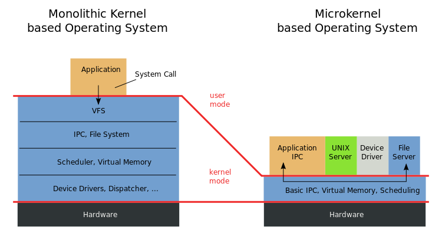

# Kernel Architecture

## History and Backgroun
Pre history (processing one program):
- (1860) Analytical Engine -> Charles Babage & Ada Lovelace (gears, cogs, wheels)
- (1907) Vacuum tube
- (1940) Plugboards (vacuum tubes replacing mechanical relays)
- (1947) Transistor
- (1958) Integrated circuit

Atlas Supervisor

Minix book history

## Monolithic Kernel

## Microkernel

### Nanokernel / Picokernel

## Exokernel

## Unikernel

## Rump kernel

## References
- https://en.wikipedia.org/wiki/History_of_operating_systems
- https://en.wikipedia.org/wiki/Kernel_(operating_system)
- https://en.wikipedia.org/wiki/Monolithic_kernel
- https://en.wikipedia.org/wiki/Microkernel
- https://en.wikipedia.org/wiki/Exokernel
- https://en.wikipedia.org/wiki/Rump_kernel

