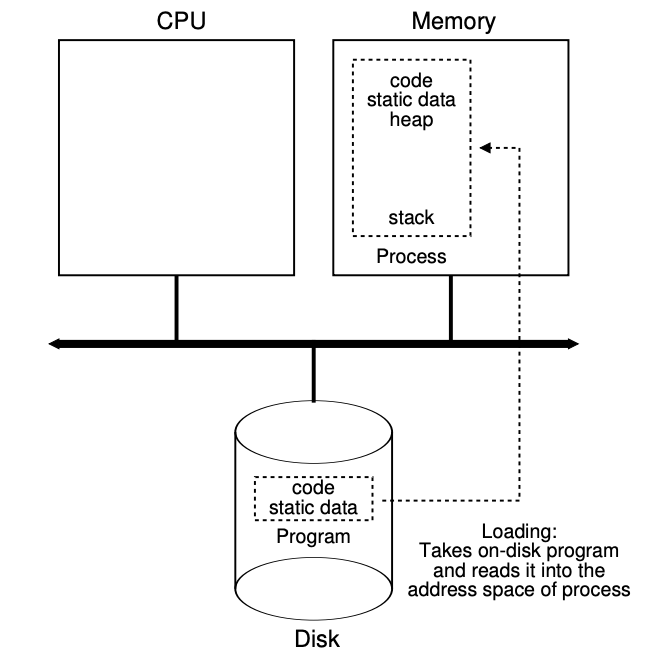

# Operating Systems

## What

A program that allows other programs to run on the computer, but maintains
control of system resources, preventing one program from going rogue. Allows
for abstractions that allows the computer to maximize resource allocation given
many programs normally run at once. It is a program itself, but also the
foundation for writing other programs and managing the system's resources.

## How it works

### History

The history of Unix / operating systems is incredibly interesting. Here is a
list of the ancestry / descendants of the most impactful operating system,
Unix.

- Altas Supervisor
- CTSS
- Multics
- Unix
- Plan 9
- Linux, GNU, BSD

For a detail discussion of the history of Unix and some of the seminal
inventions from that project, see my Unix write-up here:
<https://github.com/skilbjo/articles/blob/master/talks/unix.md>

For an incredibly interesting video shot in 1963, see
<https://www.youtube.com/watch?v=Q07PhW5sCEk>

## Programs and Processes

From the perspective of the operating system a “program” is some data in
storage that conforms to the system’s executable file format. There are many
executable file formats, but the most popular are:

- ELF (Linux)
- Mach-O (macOS)
- PE (Windows)

A program is a list of instructions for the computer to execute. These
instructions usually mean machine-code; but can also mean bytecode or scripts,
which are also considered executable.

Programs are a written instructions for the computer to execute. A process is a
running invocation of a program.

High level; a computer can only run machine instructions. There are a
finite-level of instructions that a processor can perform, which are called "op
codes", which themselves take arguments (usually a register or memory address),
but can also be an integer. Opcodes themselves derive from the instruction set
architecture a processor uses, like ARM or x86.

Example machine code (with notes/annotation):

```
[  op  |  rs |  rt | address/immediate]
   35     3     8           68           decimal
 100011 00011 01000 00000 00001 000100   binary
```

Since programming in opcodes (which itself is just a code to the opcode table)
would be painstaking, many higher-level languages have evolved to help us with
this problem. Assembly language is one example (although itself considered
low-level), it uses mnemonic instructions to represent machine code. This
enhances readability and understanding. However, assembly still needs to be
compiled into machine language.

Example assembly language:

```
MOV AL, 1h        ; Load AL with immediate value 1
MOV CL, 2h        ; Load CL with immediate value 2
MOV DL, 3h        ; Load DL with immediate value 3
MOV EAX, [EBX]    ; Move the 4 bytes in memory at the address contained in EBX into EAX
MOV [ESI+EAX], CL ; Move the contents of CL into the byte at address ESI+EAX
MOV DS, DX        ; Move the contents of DX into segment register DS
```

However, this is still difficult to read. Additionally, in the 70s, many
computers had their own processor instruction sets. IE, there were many more
versions than we have coalesced on today (ARM, x86). Thus, a program written in
assembly would need to be completely re-written for another computer, which
would most certainly have a different processor architecture. (As a side note,
the beginnings of virtualization came about during this period too, to deal
with this problem.) A solution was the C language, which in theory be a
universal language, and abstract away the difference between a program written
in a language (C) vs the concrete representation of that program (machine-code
executable). This would separate out the list of concerns: the program from the
implementation. It creates the problem for another program, the compiler, to
take high-level C code and turn that into assembly code, which then can use an
assembler to turn the assembly into machine code.

```
#include<stdio.h>

void print_hello_world(){
  printf("Hello world!\n");
}

int main(void){
  print_hello_world();
  return 0;
}
```

Assembly language of this C program:

```
  .section  __TEXT,__text,regular,pure_instructions
  .macosx_version_min 10, 12
  .globl  _print_hello_world
  .p2align  4, 0x90
_print_hello_world:                     ## @print_hello_world
  .cfi_startproc
## BB#0:
  pushq %rbp
Ltmp0:
  .cfi_def_cfa_offset 16
Ltmp1:
  .cfi_offset %rbp, -16
  movq  %rsp, %rbp
Ltmp2:
  .cfi_def_cfa_register %rbp
  subq  $16, %rsp
  leaq  L_.str(%rip), %rdi
  movb  $0, %al
  callq _printf
  movl  %eax, -4(%rbp)          ## 4-byte Spill
  addq  $16, %rsp
  popq  %rbp
  retq
  .cfi_endproc

  .globl  _main
  .p2align  4, 0x90
_main:                                  ## @main
  .cfi_startproc
## BB#0:
  pushq %rbp
Ltmp3:
  .cfi_def_cfa_offset 16
Ltmp4:
  .cfi_offset %rbp, -16
  movq  %rsp, %rbp
Ltmp5:
  .cfi_def_cfa_register %rbp
  subq  $16, %rsp
  movl  $0, -4(%rbp)
  callq _print_hello_world
  xorl  %eax, %eax
  addq  $16, %rsp
  popq  %rbp
  retq
  .cfi_endproc

  .section  __TEXT,__cstring,cstring_literals
L_.str:                                 ## @.str
  .asciz  "Hello world!\n"

.subsections_via_symbols
```

Disassembled machine code of above program:

```
artifact/hello-world-parallel:  file format Mach-O 64-bit x86-64

Disassembly of section __TEXT,__text:
__text:
100000e76:  55  pushq %rbp
100000e77:  48 89 e5  movq  %rsp, %rbp
100000e7a:  48 83 ec 10   subq  $16, %rsp
100000e7e:  89 7d fc  movl  %edi, -4(%rbp)
100000e81:  48 89 75 f0   movq  %rsi, -16(%rbp)
100000e85:  b9 00 00 00 00  movl  $0, %ecx
100000e8a:  ba 00 00 00 00  movl  $0, %edx
100000e8f:  be 00 00 00 00  movl  $0, %esi
100000e94:  48 8d 3d 0c 00 00 00  leaq  12(%rip), %rdi
100000e9b:  e8 58 00 00 00  callq 88
100000ea0:  b8 00 00 00 00  movl  $0, %eax
100000ea5:  c9  leave
100000ea6:  c3  retq
100000ea7:  55  pushq %rbp
100000ea8:  48 89 e5  movq  %rsp, %rbp
100000eab:  48 83 ec 20   subq  $32, %rsp
100000eaf:  48 89 7d e8   movq  %rdi, -24(%rbp)
100000eb3:  e8 4c 00 00 00  callq 76
100000eb8:  89 45 fc  movl  %eax, -4(%rbp)
100000ebb:  8b 45 fc  movl  -4(%rbp), %eax
100000ebe:  89 c6   movl  %eax, %esi
100000ec0:  48 8d 3d 81 00 00 00  leaq  129(%rip), %rdi
100000ec7:  b8 00 00 00 00  movl  $0, %eax
100000ecc:  e8 39 00 00 00  callq 57
100000ed1:  8b 45 fc  movl  -4(%rbp), %eax
100000ed4:  85 c0   testl %eax, %eax
100000ed6:  75 1e   jne 30 <_main._omp_fn.0+0x4F>
100000ed8:  e8 21 00 00 00  callq 33
100000edd:  89 45 f8  movl  %eax, -8(%rbp)
100000ee0:  8b 45 f8  movl  -8(%rbp), %eax
100000ee3:  89 c6   movl  %eax, %esi
100000ee5:  48 8d 3d 73 00 00 00  leaq  115(%rip), %rdi
100000eec:  b8 00 00 00 00  movl  $0, %eax
100000ef1:  e8 14 00 00 00  callq 20
100000ef6:  c9  leave
100000ef7:  c3  retq

_main:
100000e76:  55  pushq %rbp
100000e77:  48 89 e5  movq  %rsp, %rbp
100000e7a:  48 83 ec 10   subq  $16, %rsp
100000e7e:  89 7d fc  movl  %edi, -4(%rbp)
100000e81:  48 89 75 f0   movq  %rsi, -16(%rbp)
100000e85:  b9 00 00 00 00  movl  $0, %ecx
100000e8a:  ba 00 00 00 00  movl  $0, %edx
100000e8f:  be 00 00 00 00  movl  $0, %esi
100000e94:  48 8d 3d 0c 00 00 00  leaq  12(%rip), %rdi
100000e9b:  e8 58 00 00 00  callq 88
100000ea0:  b8 00 00 00 00  movl  $0, %eax
100000ea5:  c9  leave
100000ea6:  c3  retq

_main._omp_fn.0:
100000ea7:  55  pushq %rbp
100000ea8:  48 89 e5  movq  %rsp, %rbp
100000eab:  48 83 ec 20   subq  $32, %rsp
100000eaf:  48 89 7d e8   movq  %rdi, -24(%rbp)
100000eb3:  e8 4c 00 00 00  callq 76
100000eb8:  89 45 fc  movl  %eax, -4(%rbp)
100000ebb:  8b 45 fc  movl  -4(%rbp), %eax
100000ebe:  89 c6   movl  %eax, %esi
100000ec0:  48 8d 3d 81 00 00 00  leaq  129(%rip), %rdi
100000ec7:  b8 00 00 00 00  movl  $0, %eax
100000ecc:  e8 39 00 00 00  callq 57
100000ed1:  8b 45 fc  movl  -4(%rbp), %eax
100000ed4:  85 c0   testl %eax, %eax
100000ed6:  75 1e   jne 30 <_main._omp_fn.0+0x4F>
100000ed8:  e8 21 00 00 00  callq 33
100000edd:  89 45 f8  movl  %eax, -8(%rbp)
100000ee0:  8b 45 f8  movl  -8(%rbp), %eax
100000ee3:  89 c6   movl  %eax, %esi
100000ee5:  48 8d 3d 73 00 00 00  leaq  115(%rip), %rdi
100000eec:  b8 00 00 00 00  movl  $0, %eax
100000ef1:  e8 14 00 00 00  callq 20
100000ef6:  c9  leave
100000ef7:  c3  retq
Disassembly of section __TEXT,__stubs:
__stubs:
100000ef8:  ff 25 12 01 00 00   jmpq  *274(%rip)
100000efe:  ff 25 14 01 00 00   jmpq  *276(%rip)
100000f04:  ff 25 16 01 00 00   jmpq  *278(%rip)
100000f0a:  ff 25 18 01 00 00   jmpq  *280(%rip)
Disassembly of section __TEXT,__stub_helper:
__stub_helper:
100000f10:  4c 8d 1d f1 00 00 00  leaq  241(%rip), %r11
100000f17:  41 53   pushq %r11
100000f19:  ff 25 e1 00 00 00   jmpq  *225(%rip)
100000f1f:  90  nop
100000f20:  68 00 00 00 00  pushq $0
100000f25:  e9 e6 ff ff ff  jmp -26 <__stub_helper>
100000f2a:  68 15 00 00 00  pushq $21
100000f2f:  e9 dc ff ff ff  jmp -36 <__stub_helper>
100000f34:  68 30 00 00 00  pushq $48
100000f39:  e9 d2 ff ff ff  jmp -46 <__stub_helper>
100000f3e:  68 4a 00 00 00  pushq $74
100000f43:  e9 c8 ff ff ff  jmp -56 <__stub_helper>
```

The way to take source code and generate a machine code executable (referred to as a binary):

```
gcc hello-world.c -o hello-world
```

The way to get assembly output from source code:

```
gcc -S hello-world.c -o hello-world.s
```

The way to get disassembled machine code from the assembly output from source code:

```
objdump -S disassemble > hello-world.dump
```

How does the computer get the high level C source code and generate machine
code? From four steps:

- preprocessing
- compiling
- assembling
- linking

Preprocessing will strip comments, join continued lines (lines ending with a
`\`, etc.

The compilation step will take preprocessed code and translate it into
assembly.

The assembly stage is when you use an assembler to translate assembly into
object code. (The file here is suffixed with .o). This turns the assembly code
into mostly machine code, but some pieces of the program are out-of-order or
are missing.

The final stage is to gather the object code and link it. This produces the
final program. The linker will arrange the object code so functions in some
pieces of code can successfully call functions into other pieces of code. It
will use shared system libraries, such as the code that actually prints
characters to stdout. The "linking" in linker connects the libraries.

Three core parts of this:

compiler / compiler toolchain programs: `gcc` / `cc` / `c99` / `clang`
linkers: `ld`
object dumper: `objdump`

Now, we have a program. To turn it into a process (a running invocation of a
program), we need to have a fork/exec and copy the program's instructions into
our instructions and then set the instruction pointer to start at the
entrypoint of the program.

System call with switch into kernel mode, kernel code will read the cat program
from disk, create a stack/heap, and then set the instruction pointer to the
first line of main in the now-loaded process.



Things a program will get from the operating system:
- pretend it's the only program running
- its own address space, which more addressable memory than is actually in the
  system
- a program counter / instruction pointer (used to manage the current state of
  which instructions are to be run by the processor next)
- a stack pointer and a frame pointer (useed to manage the stack for function
  parameters and local variables)

The operating system will then allow the process to temporarily take over
control of the processor; but only for a short time. The operating system /
kernel will reassert itself when an interrupt happens, such as a system call,
an I/O interrupt, or a timer interrupt.

### Fork / exec (System calls)

A process is created when a process clones itself and then copies the program's
memory into its own memory. It is an unusual way of doing something (as opposed
to say, the more natural way of just creating a new process), but this is the
way it's done.

## Kernel, Userland, System Call

System calls give programs an API to call kernel code and have the kernel go do
something for the program. For example, in userland, a process can't normally
start talking with the harddrive and requesting random blocks. Or, it can't
start sending information into the IP layer. It does have the ability however
to use the kernel API to read a file from disk, or send a packet. When this
happens, the program interrupts, there is a context switch into kernel code,
work happens, and then a context switch back into userland.

## Process Execution and Scheduling

Timer interrupt, hardware interrupts

Context switching involves saving program state (values of registers,
intruction pointer, and what is in RAM)

Program A working -> working -> \*timer interrupt\* -> context switch to kernel
code -> do work to save program A state -> do work to load program B state ->
start execution of program B

## Concurrency, Threading, Parallel Programming

Concurrency - illusion of two or more things happening at once, when in reality
only one thing is happening at a time.

Threads -
Threads are a unit of execution. In Linux, the only difference between a thread
and a process, is a shared memory address (thread) vs a new memory address
(process).

Threads vs Processes

Lightweight threads vs POSIX threads
POSIX threads are a separate unit of execution as described above. However,
some interpreted languages don't support POSIX threads and give a
pseudo-thread, which is not the same. These are typically called green-threads.
In python, there is something called a global interpreter lock (GIL), which
prevents POSIX threading. However, in python, you can still do threading
(managed by the python interpreter), but it will not allow multiple I/O to
happen at once- only if there is blocking I/O happening, will it allow some
CPU-intensive threads to run. However, if no CPU-work is available, it will
yield and the process will put itself back on the blocked queue as opposed to
keep running.

Parallelism - two things actually happening at once. Many hazards!

## Hierarchical Filesystem

Abstractions of files, directors, links

Files are just random places on the hard drive. They are not physicallly next
to each other. As such, heirarchical filesystem is just a userland abstraction.
Directories are just files, with the file itself being a list of the files in the directory.
Heirarchical file path such as /usr/local/bin/some-file is
1: go to / and open up the directory
2: see where /usr directory is
3: go to /usr and open up the directory file
4: see where ./local directory file is
5: go to /usr/local/ and open up the directory file
6: see if some-file is a file, and if so go to that file location
7: open up /usr/local/some-file

As you can see, the deeper the file tree, the longer it takes the operating
system to find that file

inode

No such newlines

## Virtual Memory

Page size, page table

Program thinks it has all the RAM in the system. It also thinks it has more
memory than is actually in the system (ie 64 bit addressesable RAM - 64 bits is
a very large number, so that addressesable RAM space means far too many
addresses than actually exist with modern hardware)

If two processes share same instructions, page table will reference the same
physical memory (an optimization).

Translation lookaside buffer

## Inter-process Communication

How to pass messages between to processes?

Can use RAM, but that will get tricky very fast. When is RAM ready for writing,
and when is it ready for reading? Many hazards.

Mutex and semaphores

## Virtual Machines and Containers

Hypervisors

Virtual Machines

Containers: not a VM at all! Doesn't even try to be. Just provides process
isolation and can constrain resources (max CPU, max RAM). Needs to be on a
Linux system.

## References
- <http://www.lurklurk.org/linkers/linkers.html>
- <http://pages.cs.wisc.edu/~remzi/OSTEP/cpu-intro.pdf>
