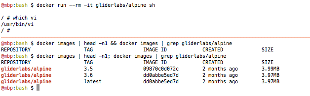

## This is my development environment


A development environment is the work station of engineer; the mechanic in his
workshop. A craftsman by trade, he will go to extreme lengths to perfect the
workstation.

Here are some of my favorite tools, that I take pride in working in and
developing in.

### operating system: unix

Ken Thompson and Dennis Ritchie, albeit standing on the shoulders of giants,
have done so much for computing as we know it today. They've won the Turing
Award and National Medal of Technology and Innovation for good reason. Unix is
a fantastic system.

Due to some interesting history (see: Unix wars), Unix from Bell Labs is no
longer around, but there are various systems today that inherit the Unix spirit.

See my unix talk: https://github.com/skilbjo/articles/blob/master/talks/unix.md


### shell: bash

Bash (GNU's take on Stephen Bourne's /bin/sh program, sarcastically named
"bourne again shell"; which is inline with other GNU acronyms like GNU's Not
Linux) is the default shell of mac OS and most Linux distributions.

as an aside, here are some notable Unix systems with non-bash default shells:
FreeBSD = /bin/tcsh (the C shell)
OpenBSD = /bin/ksh  (the Korn shell)

Additionally, here are some fantastic bash settings that make it friendlier to use:

```bash
bind 'set show-all-if-ambiguous on'
bind 'TAB:menu-complete'
bind 'set completion-ignore-case on'
bind 'set visible-stats on'
bind 'set page-completions off'
```

Also as an aside, I personally enjoy the Fish shell ("Finally, a command line shell for the 90s")


### text editor: vim



When I first learned coding, my mentor was using Sublime Text 2 so I emulated
using that for a long time. However, when I landed my first software
engineering job, I thought it best to pick up a "deeper" "more programmer" text
editor like emacs or vi/vim. Whilst vim was super confusing, I had already been
forced to learn a few vi commands when ssh'ing around the various Raspberry Pi
/ Arduinos I bought when I first decided to pick up programming. Vi was often
the only command-line text editor program installed by default on small
operating systems that may not have internet connections.

Warning: a few months after you get the hang of vim, you will customize the
hell out of it with your favorite plugins and keybindings. Here are some key
settings:

```vimscript
set number
set nowrap

set tabstop=2
set shiftwidth=2
set softtabstop=2
set smarttab
set expandtab
set ruler title laststatus=2
set backspace=2

syntax on
set listchars=tab:▸\ ,eol:¬,nbsp:⋅,trail:•
set noswapfile
set nobackup
set nowb

if exists('+colorcolumn')
  set colorcolumn=80   "Show margin
endif
```

Keybindings:
```vimscript
" general
noremap ;             :
imap ;                 <ESC>:
let mapleader =       ","

" escape characters
inoremap <leader>~    `
inoremap …            ;
inoremap Ú            :
nnoremap <Bslash> ;

" nativation
map 1           $
map 2           ^
map 9           ^

" tabs
noremap <C-t>         :tabnew<CR>
nnoremap <C-w>        :tabclose!<CR>
noremap  <C-x>        :tabclose!<CR> " }}}

" tab navigation
nnoremap –            gT
nnoremap ≠            gt
inoremap –            <C-o>gT
inoremap ≠            <C-o>gt

" vertical split
nnoremap <leader>t    <C-W>v<C-W>l

" horizontal split
nnoremap <leader>h    :split<CR><C-W>j

" split navigation
nnoremap <C-n>        <C-W><C-W>
inoremap <C-n>        <C-w><C-w>
```

And plugins:
```vimscript
# general
NeoBundle 'vim-airline/vim-airline'
NeoBundle 'vim-airline/vim-airline-themes'
NeoBundle 'NLKNguyen/papercolor-theme', { 'rev' : '867b051d3a' }
NeoBundle 'scrooloose/nerdcommenter'    " quick toggle of comments

# clojure
NeoBundle 'tpope/vim-fireplace'         " clojure REPL in vim
NeoBundle 'tpope/vim-salve'             " clojure quasi-REPL fallback
NeoBundle 'venantius/vim-cljfmt'        " :cljfmt in vim
NeoBundle 'venantius/vim-eastwood'      " clojure linter
```

### terminal multiplexer: tmux


In the beginning, there was screen. And it was ok. But over time, people wanted
features like vertical splits, not just horizontal splits. There was talk of
adding a radical new feature -- vertical splits. A developer even implemented
the feature in a branch. There was talk that this feature would be merged
"soon". This was 2007 when GNU screen was on version 4.0.1. 10 years later, we
are on GNU screen version 4.6.2, with still no vertical split. GNU's source
code is a fantastic example of a dead project, filled with spaghetti code.

Along came tmux.

Side note: tmux is included in OpenBSD by default. The OpenBSD benevolent
dictator, Theo de Raadt, was notablely frustrated (in a good way) for his
inability to find security flaws or bugs in tmux.

## programming language: Clojure


Clojure is a breath of fresh air with mystical roots. Here are examples of
technology stacks a business might use from various eras in the history of
computing:

- pre-1940s: accountants, actuaries
- 1943-1949: vacuum tubes
- 1949-1972: assembly (various dialects, dependant on the vendors processor API)
*Also: 1958 invention of the integrated circuit*
*Also: 1958: the invention of the LISP programming language!*
- 1972-1993: the C programming language (meant original to generate various assembly dialects from one source code)
- 1995-2007: Java programming language (the preferred enterprise language!)
- 2007: Ruby on Rails (sarcastically!)
*Also: 2007 initial public release of Clojure*
- 2008-2015: Python (first invented: 1991, before Java!)
- 2015-modern era: Clojure!

Clojure is phenomenal. The ability for it to target multiple runtimes is
phenomenal.  Its primary platform is the Java Virtual Machine, but other target
implementations exist; the most popular: Clojurescript (can run in the browser
or with node.js). There is also ClojureCLR that interoperates with .NET. There
are also variant implementations such as:

-clojure-py: Clojure to run on Python
-rouge: Clojure atop Ruby
-CljPerl: Clojure atop Perl

See my (learn (LISP)) talk here: <https://github.com/skilbjo/articles/tree/master/2600>


### database: Postgresql

### cloud environment: aws

### cloud: aws

### others
- version control: git/github
- hardware setup: macOS laptop, wireless mac keyboard, mac magic mouse, mac trackpad, 1/2 large screens
- chat: slack
- infrastructure tools: kafka
