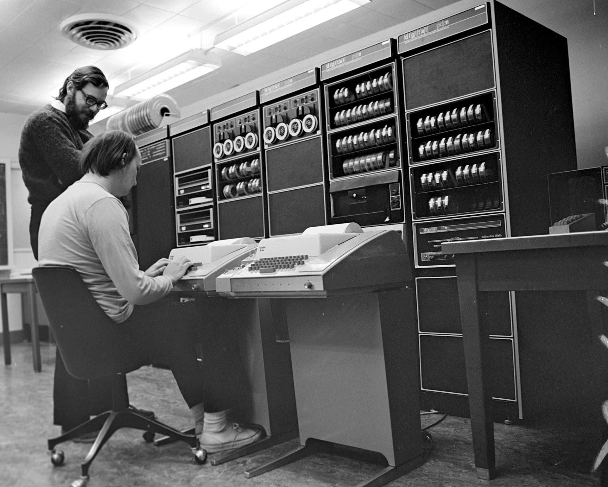
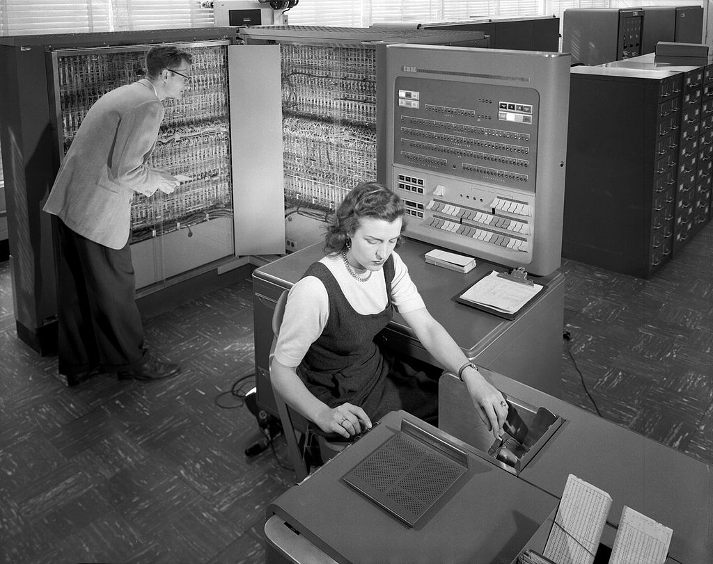

# UNIX

## What is it

## Name
Munics -> Multiplexed Information and Computing Service)
Unics -> UNiplexed Information and Computing Service)

## History and background

### Operating Systems
Through the 1950s, many major features were pioneered in the field of operating systems, including batch processing, input/output interrupt, buffering, multitasking, spooling, runtime libraries, link-loading, and programs for sorting records in files. These features were included or not included in application software at the option of application programmers, rather than in a separate operating system used by all applications.

OS/360 also pioneered the concept that the operating system keeps track of all of the system resources that are used, including program and data space allocation in main memory and file space in secondary storage, and file locking during update. When the process is terminated for any reason, all of these resources are re-claimed by the operating system.

The earliest computers were mainframes that lacked any form of operating system. Each user had sole use of the machine for a scheduled period of time and would arrive at the computer with program and data, often on punched paper cards and magnetic or paper tape. The program would be loaded into the machine, and the machine would be set to work until the program completed or crashed. Programs could generally be debugged via a control panel using dials, toggle switches and panel lights.
Symbolic languages, assemblers, and compilers were developed for programmers to translate symbolic program-code into machine code that previously would have been hand-encoded. Later machines came with libraries of support code on punched cards or magnetic tape, which would be linked to the user's program to assist in operations such as input and output. This was the genesis of the modern-day operating system; however, machines still ran a single job at a time. At Cambridge University in England the job queue was at one time a washing line from which tapes were hung with different colored clothes-pegs to indicate job-priority.[1]
As machines became more powerful the time to run programs diminished, and the time to hand off the equipment to the next user became large by comparison. Accounting for and paying for machine usage moved on from checking the wall clock to automatic logging by the computer. Run queues evolved from a literal queue of people at the door, to a heap of media on a jobs-waiting table, or batches of punch-cards stacked one on top of the other in the reader, until the machine itself was able to select and sequence which magnetic tape drives processed which tapes.

### Bell Labs
The French government awarded Alexander Graham Bell $10,000 for the invention of the
telephone; which Bell used to fund the Volta Laboratory. In 1925, the engineering
department of the American Telephone & Telegraph company and Western Electric Laboratories
consolidated to form a seperate entity; ownership of which was shared by AT&T and Western
Electric.

8 Nobel Prizes have been awarded to people for work completed at Bell Labs. Noteably,
in 1947 the transistor was invented my John Bardeen, Walter Houser Brattain, and William
Bradford Shockley. Ken Thompson and Dennis Ritchie were awarded in in the early 80s
for their work on operating system theory and for developing Unix.

### Unix family tree
Dates are when development work first started; not release date.

Pre history (tools for calculation, harnessing electric logic, processing one program):
- (2300BC, 600BC, 500BC, 200BC) Abacus -> Mesopotamian, Persian, Greek, Chinese
- (1642) Pascal's calulator
- (1786,1823) Difference Machine & Difference Engine -> J.H. Muller (engineer in Hessian army), Charles Babage
- (1835) Analytical Engine -> Charles Babage & Ada Lovelace (gears, cogs, wheels)
- (1907) Vacuum tube
- (1940) Plugboards (vacuum tubes replacing mechanical relays)
- (1947) Transistor
- (1958) Integrated circuit

(batch processing -> multiprogramming -> time sharing)
- (1957) Atlas Supervisor & BESYS (Bell Operating System)
- (1961) Compatible Time-Sharing System (CTSS)
- (1964) Multics
- (1969) UNIX -> (1978) *BSD -> (1987) Mach -> (2000) Darwin
- (1985) Plan 9
- (1987) Minix
- (1991) Linux
- (1996) Inferno

## Philosophy

## Ancient UNIX vs Research UNIX vs Commercial UNIX

## Legacy
### Plan 9

### Inferno

### Minix

### Linux

## References
- https://www.youtube.com/watch?v=XvDZLjaCJuw
