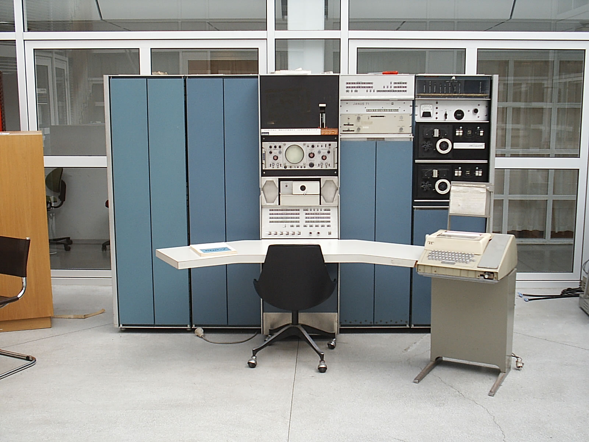

# UNIX

## What is it

Unix (trademarked as UNIX) is a family of multitasking, multiuser computer operating
systems that derive from the original AT&T Unix, developed starting in the 1970s
at the Bell Labs research center by Ken Thompson, Dennis Ritchie.

Initially intended for use inside the Bell System, AT&T licensed Unix to outside
parties from the late 1970s, leading to a variety of both academic and commercial
variants of Unix from vendors such as the University of California, Berkeley (BSD),
Microsoft (Xenix), IBM (AIX) and Sun Microsystems (Solaris). AT&T finally sold its
rights in Unix to Novell in the early 1990s, which then sold its Unix business to
the Santa Cruz Operation (SCO) in 1995, but the UNIX trademark passed to the
industry standards consortium The Open Group, which allows the use of the mark for
certified operating systems compliant with the Single UNIX Specification (SUS).
Among these is Apple's macOS, which is the Unix version with the largest installed
base as of 2014.

Many Unix-like operating systems have arisen over the years, of which Linux is the
most popular, having displaced SUS-certified Unix on many server platforms since
its inception in the early 1990s. Android, the most widely used mobile operating
system in the world, is in turn based on Linux.

## Name
- Munics -> Multiplexed Information and Computing Service)
- Unics -> UNiplexed Information and Computing Service)

## History and background

### Operating Systems
Why were operating systems needed?

The earliest computers were mainframes that lacked any form of operating system.
Each user had sole use of the machine for a scheduled period of time and would
arrive at the computer with program and data, often on punched paper cards and
magnetic or paper tape. The program would be loaded into the machine, and the
machine would be set to work until the program completed or crashed. Programs
could generally be debugged via a control panel using dials, toggle switches and
panel lights.

As machines became more powerful the time to run programs diminished, and the time
to hand off the equipment to the next user became large by comparison. Accounting
for and paying for machine usage moved on from checking the wall clock to automatic
logging by the computer. Run queues evolved from a literal queue of people at the
door, to a heap of media on a jobs-waiting table, or batches of punch-cards stacked
one on top of the other in the reader, until the machine itself was able to select
and sequence which magnetic tape drives processed which tapes.

IBM (manufacturer of most computers) was slow to introduce operating systems:
General Motors produced General Motors OS in 1955 and GM-NAA I/O in 1956 for use
on its own IBM computers; and in 1962 Burroughs Corporation released MCP and General
Electric introduced GECOS, in both cases for use by their customers.

The first operating systems for IBM computers were written by IBM customers
who did not wish to have their very expensive machines sitting idle while operators
set up jobs manually, and so they wanted a mechanism for maintaining a queue of jobs.

Through the 1950s, many major features were pioneered in the field of operating
systems, including batch processing, input/output interrupt, buffering, multitasking,
spooling, runtime libraries, link-loading, and programs for sorting records in
files.  These features were included or not included in application software at
the option of application programmers, rather than in a separate operating system
used by all applications.

Symbolic languages, assemblers, and compilers were developed for programmers to
translate symbolic program-code into machine code that previously would have been
hand-encoded. Later machines came with libraries of support code on punched cards
or magnetic tape, which would be linked to the user's program to assist in operations
such as input and output. This was the genesis of the modern-day operating system;
however, machines still ran a single job at a time.  At Cambridge University in
England the job queue was at one time a washing line from which tapes were hung
with different colored clothes-pegs to indicate job-priority.

OS/360 (an IBM OS from the mid 60s) pioneered the concept that the operating system
keeps track of all of the system resources that are used, including program and
data space allocation in main memory and file space in secondary storage, and file
locking during update.  When the process is terminated for any reason, all of these
resources are re-claimed by the operating system.

### CTSS (Time sharing)

> "Much of my work has come from being lazy. I didn't like writing programs, and
> so, when I was working on the IBM 701, writing programs for computing missile
> trajectories, I started work on a programming system to make it easier to write
> programs."
 -- John Backus

John Backus (creator of first high-level language- FORTRAN, Backus-Naur Form) said
in the 1954 summer session at MIT that "By time-sharing, a big computer could be
used as several small ones; there would need to be a reading station for each user".
However, the computers (IBM 704), were not powerful enough to implement such a system.
In June 1959, Christopher Strachey published a paper "Time Sharing in Large Fast
Computers" at the UNESCO Information Processing Conference in Paris, where he envisaged
a programmer debugging a program at a console (like a teletype) connected to the
computer, while another program was running in the computer at the same time. Debugging
programs was an important problem at that time, because with batch processing, it
then often took a day from submitting a changed code, to getting the results. John
McCarthy wrote a memo about that at MIT, after which a preliminary study committee
and a working committee were established at MIT, to develop time-sharing. The committees
envisaged many users using the computer at the same time, decided the details of
implementing such system at MIT, and started the development of the system.

- [https://www.youtube.com/watch?v=Q07PhW5sCEk#t=6m](https://www.youtube.com/watch?v=Q07PhW5sCEk#t=6m)

### Bell Labs

The French government awarded Alexander Graham Bell $10,000 for the invention of the
telephone; which Bell used to fund the Volta Laboratory. In 1925, the engineering
department of the American Telephone & Telegraph company and Western Electric Laboratories
consolidated to form a seperate entity; ownership of which was shared by AT&T and Western
Electric.

8 Nobel Prizes have been awarded to people for work completed at Bell Labs. Noteably,
in 1947 the transistor was invented my John Bardeen, Walter Houser Brattain, and William
Bradford Shockley. Ken Thompson and Dennis Ritchie were awarded in in the early 80s
for their work on operating system theory and for developing Unix.

### Unix family tree
Dates are when development work first started; not release date.

Pre history (tools for calculation, harnessing electric logic, processing one program):
- (2300BC, 600BC, 500BC, 200BC) Abacus -> Mesopotamian, Persian, Greek, Chinese
- (1642) Pascal's calulator
- (1786,1823) Difference Machine & Difference Engine -> J.H. Muller (engineer in Hessian army), Charles Babage
- (1835) Analytical Engine -> Charles Babage & Ada Lovelace (gears, cogs, wheels)
- (1907) Vacuum tube
- (1940) Plugboards (vacuum tubes replacing mechanical relays)
- (1947) Transistor
- (1958) Integrated circuit

(batch processing -> multiprogramming -> time sharing)
- (1957) Atlas Supervisor & BESYS (Bell Operating System)
- (1961) Compatible Time-Sharing System (CTSS)
- (1964) Multics
- (1969) UNIX -> (1978) *BSD -> (1987) Mach -> (2000) Darwin
- (1985) Plan 9
- (1987) Minix
- (1991) Linux
- (1996) Inferno

## Philosophy
The Unix philosophy, originated by Ken Thompson, is a set of cultural norms and
philosophical approaches to minimalist, modular software development.  Unix developers
were important in bringing the concepts of modularity and reusability into software
engineering practice, spawning a "software tools" movement.

### The Bell System Technical Journal (1978)
> Make each program do one thing well. To do a new job, build afresh rather than
> complicate old programs by adding new "features".

> Expect the output of every program to become the input to another, as yet unknown,
> program. Don't clutter output with extraneous information. Avoid stringently columnar
> or binary input formats. Don't insist on interactive input.

> Design and build software, even operating systems, to be tried early, ideally within
> weeks. Don't hesitate to throw away the clumsy parts and rebuild them.

> Use tools in preference to unskilled help to lighten a programming task, even if
> you have to detour to build the tools and expect to throw some of them out after
> you've finished using them.

## Mike Gancarz (author of X windowing system): The UNIX Philosophy
> Small is beautiful.

> Make each program do one thing well.

> Build a prototype as soon as possible.

> Choose portability over efficiency.

> Store data in flat text files.

> Use software leverage to your advantage.

> Use shell scripts to increase leverage and portability.

> Avoid captive user interfaces.

> Make every program a filter.

## Ancient UNIX vs Research UNIX vs Commercial UNIX

## Legacy
### Plan 9
Under development from the mid 80s til mid 90s, Plan 9 was the Bell Labs successor
to UNIX, meant to clean up many of UNIX's loose threads, such as "everything is
a file" and inter process communication.

### Inferno
Under computing threat from Sun, with the Java processor, Java OS, Java Virtual
Machine (Write Once Run Anywhere), and Java language, Bell Labs discontinued Plan 9
to start on a competing computing platform. Similar to Plan 9 but with two noteable
features: a virtual machine called Dis, and a new programming language called
Limbo.

### Minix
Microkernel. Slow to adapt new features. Meant as a teaching system. Strictly
implements POSIX.

### Linux
Monolithic kernel. Fast to adapt new features.

## The UNIX Time-Sharing System (Original Unix Paper, 1974)

### 1. Introduction
Key words and prases: time-sharing, operating system, file system, command
language, PDP-11

- First version: assembly on a PDP-7
- Second version: assembly on a PDP-11/20
- Third version: C on a PDP-11/40 & /45

Since Feb 1971, 40 installations have been put into service. Unix can run on hardware
costing as little as $40k ($210k in 2017).

- hierarchical file system, incorporating demountable volumes
- compatible file, device, and interprocess communication
- ability to initial asynchronous processes
- system command language selectable on a per-use basis
- over 100 subsystems including a dozen languages

Most "real" uses are the formatting of patent applications and other textual data,
as well as collection and processing of data from switching machines (being AT&T Bell Labs),
but Ken Thompson and Dennis Ritchie's use is manualy for research in operating
systems, languages, computer networks, and other topics in computer science.

The major programs available under UNIX are: assembler, text editor based on QED,
linking loader, symbolic debugger, compiler for a language called C, an interpreter
for BASIC, a text formatting program, a Fortran compiler, a Snobol interpreter,
a top-down compiler (TMG), a bottom-u compiler (YACC), a form letter generator,
a macro processor, and a permuted index program. (But wait there's more!) there
is laos a host of maintenance, utility, recreation, and novelty programs.

### 2. Hardware and Software Environment
The PDP-11/45 is a 16-bit word computer with 144kb of core memory (RAM). UNIX kernel
occupies 42K bytes at runtime. The system however includes a large number of device
drivers and enjoys generous allotment of space of I/O buffers and system tables.

The PDP-11/45 has 1mb of fixed-head disk, used for file system storage and memory
swapping, and four moving-head disk drives which each proved 2.5mb. There is a
console typewriter, a 14 variable-speed communication interface, a line printer,
a Picturephone interface, a voice response unit, a voice synthesizer, a digital
switching network, and a satellite PDP-11/20 which generates vectors, curves, and
characters on a Tektronix 611 storage-tube display.

The majority of the language is written in C language. Early versions were written
in assembly language. The size of the new system is about 30% greater than the old
system, however, the new system is not only much easier to understand and modify,
but also includes multiprogramming and the ability to share reentrant code amongst
serveral user programs.

### 3. The File System
The most important job of UNIX is to provide a file system.

#### Ordinary files
No particular structure. Files of text consist simply of string of characters, with
lines demarcated by the new-line character. Binary programs are sequences of words
as they will appear in core memory when the program starts executing.

A few user programs manipulate files with more structure: the assembler generates
and the loader expects an object file in a particular format. However the structure
of files is controlled by the programs which use them, not by the system.

#### Directories
Directories provide the mapping between the names of files and the files themselves,
and thus induce a structure on the file system as a whole.

A directory behaves exactly like an ordinary except that it cannot be written on by
unpriviledged programs, so that the system controls the contents of directories.
The starting point for the file system is the root. A system directory contains
all the programs privded for general use; that is, all the commands.

Files are named by sequences of 14 or fewer characters. Directory names are seperated
by slashes "/". A file may appear in serveral directories under possibly different
names, a process called linking. A file does not exist within a particular directory;
the directory entry for a file consists merely of its name and a pointer to the file.
Thus, a file exists independently of any directory entry. A file will be made to
disappear when the last link to it disappears.

#### Special files
Special files constitute the most unusual feature of the UNIX file system. Each
I/O device supported by UNIX is associated with at least oone such file. Special
files are read and written just like ordinary files, but requests to reach or write
result in activation of the associated device. The special files reside in /dev.
Special files exist for a communication line. There are three benefits to this
I/O approach: file and device I/O are as similar as possible; file and device names
have the same syntax and meaning, so a program expecting a file name as an argument
can be passed as a device name; finally, special files are subject to the same
protection as regular files.

#### Protection
A given for new files is a set of seven protection bits (note now it is 9, for
including the group). Six independently specifcy read, write, and execute permission
for the owner of the file and for all other users.

    -rwxrwxr-- user group bytes date time filename

The seventh bit is the set-user-id bit, or a way to give non-priviledged users access
and permissions to programs that typically require root privileges (ie changing
your own login password).

The super-user is exempt from the usual constrains on file access

#### I/O
To open a file for writing or reading

    filep = open(name, flag)
    => returns file descriptor, to be used to identify subsequent calls to read/write

There are no user-visible locks in the file system, nor are there restrictions on
the number of users who may have a file open for reading or writing; so it is possible
to have a file become scrambled when two users write on it simultaneously; however
in practice, difficulties do not arise. We take the view that locaks are neither
necessary nor sufficient, in our environment, to prevent interference between users
of the same file.

Once a file is open (system interrupt), the following calls may be used:
    n = read(filep, buffer, count)
    n = write(filep, buffer, count)

To do random (direct access) I/O, it is only necessary to move the the read or write
pointer to the appropriate location in the file:
    location = seek(filep, base, offset)

### 4. Implementation of the File System
A directory entry contains only a name for the associated file and a pointer to
the file itself. The pointer is an integer called the "i-number" (for index number)
of the file. When the file is accessed, its i-number is used as an index into the
system table (called the i-list). The entry thereby found (the file's i-node) contains
the description of the file:

  - its owner
  - its protection bits
  - the physical disk or tape address for the file contents
  - its size
  - time of last modification
  - the number of links to the file
  - a bit indicating whether the file is a directory
  - a bit indicating whether the file is a special files
  - a bit indicating whether the file is "large" or "small"

The purpose of the open or create system calls is to turn the path name given by
the user into an i-number by searching the named directories; once the file is open,
its device, i-number, and read/write pointer are stored in a system table indexed
by the file descriptor returned by open or create.

When a file is created, an i-node is allocated for it and a directory entry is made
which contains the name of the file and its i-node number. Making a link involves
created a directory entry with the new name, and copying the i-number from the orignal
file entry, and incrementing the link-count field of the i-node. Removing a file
is done by decrementing the link-count of the i-node specified by its directory
entry and erasing the directory entry. If the link-count drops to 0, the disk
blocks in the file are freed and the i-node is deallocated.

To the user, both reading and writing of files appear to be synchronous and unbuffered.
That is immediately after a return from a read call the data are available, and
converseley after a write the user's workspace may be reused. In fact the system
maintains a rather complicated buffring mechanism which reduces greatly the number
of I/O operations required to access a file.

UNIX will search its buffers to see where the disk block currently resides in core
memory; if not, it will be read in from the device. A program that reads or writes
in units of 512 bytes has an advantage over a program which reads or writes a single
byte at a time, but the gain is not immense; it comes mainly from the avoidance of
system overhead.

The notion of the i-list is an unusual feature of UNIX. In practice, this method
has proved quite reliable and easy to deal with. It permits a quite simple and rapid
algorithm for checking the consistency of a file system, for example, from verification
that hte portions of each device contains useful information and those free to be
allocated are disjoin and together exhaust the space of the device. This algorithm
is independent of the directory heirarchy, since it needs to only scan the linearly-
organized i-list.

A question arises of who is to be charged for the space of a file. The current
version of UNIX avoids the issue by not charging any fees at all.

#### Efficiency
Timings were made of the assembly of a 7,621-line program. The assembly was run
alone on the machine; total wall-clock time was 35.9 sec, for a rate of 212 lines per
second. Time was deviced as fillows: 63.5% assembler execution time, 16.5% system
overhead, 20% disk wait time. We are generally satisified with the overall performance
of the system.

### 5. Processes and Images
An image is a computer execution environment-> a core image, general register values,
status of open files, current directory, and the like. An image is a psuedo computer.

A process is the execution of an image. While the processor is executing on behalf
of a process, the image must reside in core; the process remains in core unless
the appearance of an active, higher-priority process forces it to be swapped out
to the fixed-head disk. The user-core part of an image is divided into three logical
segments: the non-writable text segment begins at location 0 of virtual address space.
At the first 8K byte boundary above the text segment begins the writable data segment.
Starting at the highest address and growing down is the stack segment, which grows
downward as the hardware's stack pointer fluctuates.

    processid = fork(label)

When fork is executed, it splits into two independently executing processes. The
two processes have two independent copies of the original core image, and share
any open files. The processes differ only in that one is considered the parent
process.

    filep = pipe()

Processes may communicate with related processes using the same system "read" and
"write" calls that are used for file system I/O. The above call returns a file
descriptor and creates an interprocess channel called a "pipe". This channel, like
other open files, is passed from parent to child in the image by the "fork" call.

    execute(file, arg1, arg2, ..., argn)
    execute(/usr/bin/ls,/dev)

Another major system primative is invoked by the above system calls, which request
the system to read in and execute the program named by "file", passing it string
arguments "arg1", "arg2", ..., "argn". All the code and data in the process using
execute are replaced from the file, but open files, current director, and interprocess
relationships are unaltered. If the call fails, for example because "file" could
not be found or its execute permission was not set, does a return take place from
the execute primative; resembling a "jump" machine instruction rather than a subroutine
call.

    exit(status)

The above system call terminates a process, destroys its image, closes its open
files, and generally obliterates it.

### 6. The Shell
Communication with UNIX is carried on with the aid of a program called the Shell.
The Shell is a command line interpreter: it reads lines typed by the user and
interpreters them as requests to execute other programs. In the simplist form, a
command consists of the command name followed by arguments to the command, seperated
by spaces:

    command arg1 arg2 ...argn

A file with the name command is sought; if command is found, it is brought into
core and executed. If command cannot be found, the Shell prefixes the string `/bin`
to the command and attempts again to find the file. Director `/bin` contains all
the commands intended to be generally used.

Programs executed by the Shell start off with two open files which have file descriptors
0 and 1. File 1 is open for writing and is best understood as the standard output
file. This file is the user's typewriter. File 0 starts off open for reading, and
programs which wish to read messages typed by the user usually read from this file.

    ls >there

This command create a file called "there" and places the listing of directory files
there.

    ed <script

This command interprets "script" as a file of editor commands; thus `<script` means,
"take input from 'script'". Although the file name following a < or > appears to
be an argument to the command, it is in fact interpreted by the Shell and is not
passed to the command at all; thus no special coding to handle I/O redirection is
needed within each command.

    ls | pr -2 | opr

This is an extention of the standard I/O notion is used to direct output from one
command to the input of another.

This process could have been carried out more clumsily by:

    ls >tmp1
    pr -2 <tmp1 >tmp2
    opr <tmp2
    rm tmp1 tmp2

Another feature provided by the Shell is multitasking. Commands need not be on different
lines; instead they may be interpreted by semicolons.

    ls; ed

    /usr/home/some-complex-script &
    mail Mary

A related feature is more interesting. If a command is followed by "&", the Shell
will not wait for the command to finish before prompting again; instead, it is ready
immediately to accept a new command.

    source >output & ls >files &

    (date; ls) >x &

The Shell is itself a command, and may be called recursively. Suppose a file called
"tryout" contains the lines:

    as source
    mv a.out testprog
    testprog

    sh <tryout

This would called the Shell `sh` to execute the commands sequentially.

### 7. Traps
The PDP-11 hardware detects a number of program faults, such as references to
nonexistant memory, unimplemented instructions, and odd addresses used where an
even address is required. These fualts cause the procesor to trap to a system
routine. When an illegal action is caught, the system terminates and writes the
user's image on file "core" in the current directory. A debugger can then be used.

Programs that are looping, which produce unwanted output or about which the user
has second thoughts, may be halted by the use of the interrupt signal, which is
generated by typing the "delete" character. This signal simply cuases the program
to cease execution without producing a core image file. These hardware-generated
faults and the interrupt and quit signals can, by request, be either ignored or
caught by the process. For exmaple, the Shell ignores quits to prevent a quit from
logging the user out. The editor catches interrupts and returs to its command level,
which is useful for stopping long printouts without losing work in process.

### 8. Perspective
Perhaps paradoxically, the success of UNIX is largely due to the fact it was not
designed to meet any predefinited objectives. The first version was written when
Thompson, dissatisfied with the available computer facilities, discovered a little-
used system PDP-7 and set out to create a more hospitable environment. This personal
effort was sufficiently successful to gain the interest of Ritchie and others, and
later to justify the acquisition of the PDP-11/20, specifically to support a text
editing and formatting system. Our goals throughout the effort was always concerned
with building a comfortable relationship with the machine and exploring ideas and
inventions in operating systems. Three considerations which influenced the design
of UNIX are visible in retrospect.

First, we naturally designed the system to make it easy to write, test, and run
programs. The most important expression of our desire for programming convenience
was that the system was arranged for interactive use, even though the original version
only supported one user.

Second, there have alwayse been severe size constrains on the system and its software.
Given the partiality antagonistic desires for reasonable efficiency and expressive
power, the size constraint has encouraged not only economy but a certain elegance
of design. This may be a thinly designed version of "salvation thorugh suffering"
philosophy.

Third, the system was able to maintain itself. If designers of a system are forced
to use that system, they quickly become aware of its functional and superficial
deficiencies and are strongly motivated to correct them before it is too late.

The process control scheme and command interface have proved both convenient and
efficient. Since the Shell operates as an ordinary, swappable user program, it
consumers no wired-down space in the system proper and it may be made as powerful
as desired at listtle cost, in particular, given the framework in which the Shell
executes as a process which spawns other processes to perform commands, the notions
of I/O redirection, background processes, command files, and user-selectable system
interfaces all become essentially trivial to implment.

#### Influences
The success of UNIX lies not so much in new inventions but rather in the full exploitation
of a carefully selected set of fertile ideas, and especially in showing that they
can be keys to the implementation of a small yet powerful operating system.

The fork operation, essentially as we implemented it, was present in the Berkeley
time-sharing system. On a number of points Thompson and Ritchie were influenced
by Multics, which suggested the particular form of the I/O system calls and both
the name of the Shell and its general functions, The notion that the Shell should
create a process for each command was also suggested to us by the early design of
Multics, although in that system it was later dropped for efficiency reasons.
A similar scheme is used by TENEX.

### 9. Statistics
#### Overall
- 72 user population
- 14 maximum simultaneous users
- 300 directories
- 4,400 files
- 34,000 512-byte secondary storage blocks useed

#### CPU usage
15.7% C compiler
15.2% users’ programs
11.7% editor
5.8% Shell (used as a command, including command times)
5.3% chess
3.3% list directory
3.1% document formatter
1.6% backup dumper
1.8% assembler
(others - Fortran compiler, copy file, remove file, etc)

#### Command Access
15.3% editor
9.6% list directory
6.3% remove file
6.3% C compiler
6.0% concatenate/print file
6.0% users’ programs
3.3% list people logged on system
3.2% rename/move file
3.1% file status
1.8% library maintainer
1.8% document formatter
1.6% execute another command conditionally
(others - debugger, shell [used as a command], list processes executing)

#### Reliability
There has been loss of a file system (one disk out of five) caused by software
inability to cope with a hardware problem causing repeated power fail traps. A
"crash" is an unscheduled system reboot or halt. There is about one crash every
other day; about two-thirds are caused by hardware-related difficulties such as
power dips and inexplicable processor interrupts to random locations. The remainder
are software failures. The longest uninterrupted up time was about two weeks.
Total update time has bee nabout 98% of our 24hr / 365 day schedule.

## References
- https://www.youtube.com/watch?v=XvDZLjaCJuw
- [The UNIX Time-Sharing System](link here)
