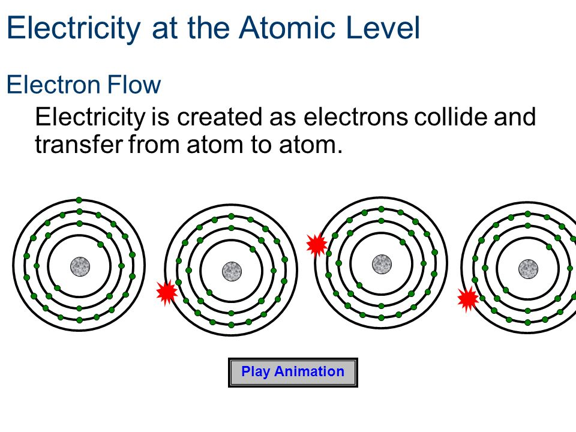
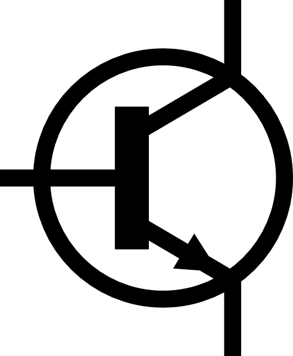
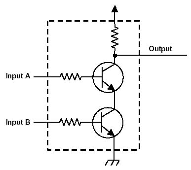
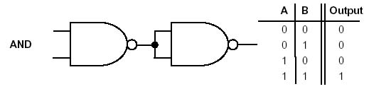
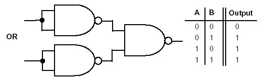
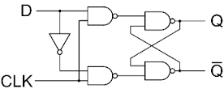
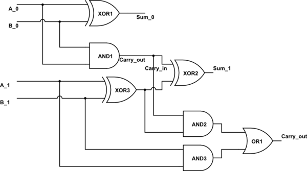
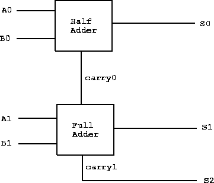
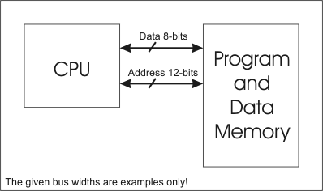

# CPU Architecture

## How it works
### Physics
- conductive material allow electrons to jump from one atom to another
- this creates current
- electrons flow from the negative terminal to the positive terminal; or source to drain

### Transistor
- basic element
- consists of three wires, a + terminal that is always on; a - terminal that connects to ground;
and a gate terminal that can be on or off. The gate is not connected to either wires. Between the +
and - terminal is a semiconductor, that when gate is on, the gate excites the semiconductor material
and turns its phyical properties from non-conducting to conducting. When the semiconductor material is
in a conductive state, the electrons to move from - to + via.
- as transistors get smaller, clock speeds can get higher
- as transistors get smaller, less power is needed. less power = less heat

### NAND Gate
- Truth table: unless A and B are both ON, gate is always ON; when A and B are ON, gate is OFF
- NAND gate consists of two transistors

### AND Gate, OR Gate, XOR, etc
- All other gates (AND, OR, XOR) can be implemented from NAND

### Flip Flop (sequential circuit)
- basic memory cell. takes two bits, a data bit and a set bit; emits an output bit
- if set bit is on, circuit will emit the data bit
- if set bit is off, circuit will only emit the data bit from when the set bit was previously on

### 2 bit adder / ALU (combinatorial circuit)

- logic and maths in base 2
-- 2 + 2 is 4
-- in base 2 that's 10 + 10 = 100
-- for this, you need a 2 bit IN, a 2 bit OUT, and a carry out
-- a full two bit adder will calculate the 2^2's place (carry), the 2^1's place (sum_1 out), and the 2^0's place (sum_0 out)

- using XOR, AND, and OR, you can create a 2 bit adder

- black box abstraction to hide the details

## von Nuemann Architectur
- the type of architecture most computers are today
- combine the sequential circuits (memory) with the combinatorial circuirts (ALU), to create a computer
- has a fetch/execute loop
- [X] fetch instruction (using instruction pointer, get instruction from memory)
- [X] decode instruction (get data from register address)
- [X] execute instruction (if add, put inputs to ALU)
- [X] store instruction (place calculation into memory)
- [X] register writeback (place calculation to destination register)
- [X] LOOP
- other types are the turing machine, stack machine

## Instructions
- hardware engineers built the "control" path of the CPU where software engineers can
implment instructions via the "data" path
- 8 bit CPU = instructions are 8 bits (1 byte) wide, 32 bit = 32 bits (4 bytes) wide
- two main instruction sets for a von Neumann architecture: CISC (x86) and RISC (ARM, MIPS)
- first 5 digits in MIPS are op codes (add, sub, mul, div, sw [store word], lw [load word]
- next 6 bits are the destination register to write the instruction to
- following two registers (6 bits each) are of where the data is for the op code

Suppose we have this function

    int sum(int a, int b){
      return a+b;
    }

This could be compiled from C into assembly:

    add $v0, $a0, $a1

- in this, `add` is the opcode, `$v0` is the destination register, `$a0` is the first argument,
and `$a1` is the second argument.
- actual MIPS code

    binary_convert:
        move $t0, $a0           # $t0 now has address of string
        li $v0, 0               # reset accumulator

    loop:
        lb $t1, 0($t0)          # load first byte of input
        beq $t1,$zero,exit
        sll $v0, $v0, 1         # increase accumulator by 2^n
        sub $t2, $t1, 48        # ascii 0 = binary 48. subtract into $t2
        add $v0, $v0, $t2       # add $t2 to accumulator
        addi $t0, $t0, 1        # increment pointer
        j loop

    exit:
        jr $ra

some stuff

## Evolution
- deeper pipelines (faster clockspeed, but in practice a smaller pipeline is better)
- L1, L2, L3 cache
- multicore
- vector operations
- adding cores is unfortunately limited by Amdahl's law, says that performance speed up has
a harsh ceiling bounded by the sequential part of our code.  50% paralized code @

    2 cores     = 80% speedup
    4 cores     = 130% speedup
    8 cores     = 180% speedup
    16 cores    = 190% speedup
    64 cores    = 195% speedup
    1024 cores  = 197% speedup
    65536 cores = 198% speedup

- GPUs for highly parallelizable tasks

## The future
- ASIC
-- industry giants (intel, samsung, taiwan semiconductor) won't talk to you
-- chinese manufacturers can custom print circuits/chips for much less
-- better customized circuits for applications.
- FGPA
-- can create custom circuitry on the fly
-- (map '[FPGA circuit] '[my data]), throw that circuit away and use another for another calculation
- graphene chips (carbon, one level above silicon), better materials properties for
transfer of electrons over the material. Prediction is 1000 GHz clock speeds
- GPUs, chips for specific purposes

## Video
- [https://www.youtube.com/watch?v=9PPrrSyubG0](https://www.youtube.com/watch?v=9PPrrSyubG0)

