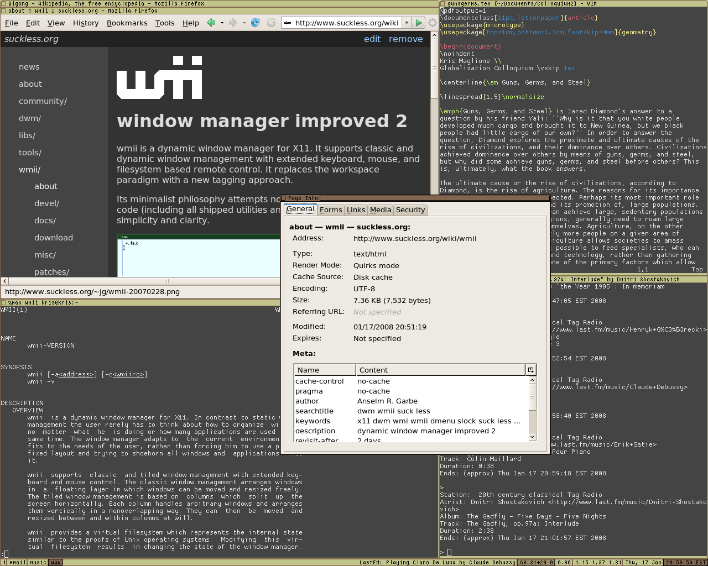
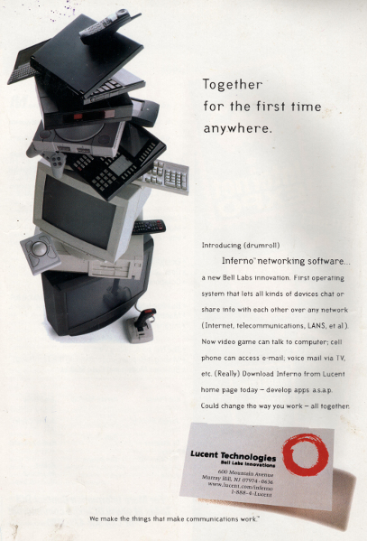

# plan9

## What is it
Plan 9 from Bell Labs is an operating system developed by the Computing Sciences
Research Center at Bell Labs, between the mid 1980s and 2002. It takes some of the
principals of Unix, developed in the same research group that developed Unix and C,
and extends those to a networked environment with graphical terminals.

The name Plan 9 comes from the 1959 science fiction movie "Plan 9 from Outer Space".
The storyline concerns extraterrestrials who are seeking to stop humanity from
creating a doomsday weapon that could destroy the universe. The aliens implement
"Plan 9", a scheme to resurrect the Earth's dead, and by causing chaos, the aliens
hope the crisis will force humanity to listen to them; if not, the aliens aim to
destroy humanity with their army of the dead. The movie has been often criticized
for its poor special effects.

- [https://www.youtube.com/watch?v=u2ukRYsYPmo](https://www.youtube.com/watch?v=u2ukRYsYPmo)

The Plan 9 Bunny (named Glenda) is a reference to a movie by the same director/actor
(Ed Woods) called "Glen or Glenda". "Glen or Glenda" is a movie about cross-dressing
from 1953.

Plan 9's first release was in 1992, when it was sent to universities in 1992; in 1995
it was available to the public for $350. In 1996 Plan 9 was put on the back burner
in favor of Inferno, intended to be a rival to Sun's Java platform. In 2000 it was
released under an open source license. The fourth and final release came in 2002.

## History and background
### Bell Labs
The French government awarded Alexander Graham Bell $10,000 for the invention of the
telephone; which Bell used to fund the Volta Laboratory. In 1925, the engineering
department of the American Telephone & Telegraph company and Western Electric Laboratories
consolidated to form a seperate entity; ownership of which was shared by AT&T and Western
Electric.

8 Nobel Prizes have been awarded to people for work completed at Bell Labs. Noteably,
in 1947 the transistor was invented my John Bardeen, Walter Houser Brattain, and William
Bradford Shockley. Ken Thompson and Dennis Ritchie were awarded in in the early 80s
for their work on operating system theory and for developing Unix.

Starting in the mid 1980s, members of the Computing Science Research Center at
Bell Labs started developing the new operating system. The team was initially lead by
Ken Thompson with support from Dennis Ritchie.

Plan 9 replaced Unix as Bill Labs's primary platform for operating research. It
explored serveral changes to the Unix system; noteably in multi-user unvironments.

### Unix family tree
Dates are when development work first started; not release date.

Pre history (processing one program):
- (1860) Analytical Engine -> Charles Babage & Ada Lovelace (gears, cogs, wheels)
- (1907) Vacuum tube
- (1940) Plugboards (vacuum tubes replacing mechanical relays)
- (1947) Transistor
- (1958) Integrated circuit

(batch processing -> multiprogramming -> time sharing)
- (1957) Atlas Supervisor & BESYS (Bell Operating System)
- (1961) Compatible Time-Sharing System (CTSS)
- (1964) Multics
- (1969) UNIX -> (1978) *BSD -> (1987) Mach -> (2000) Darwin
- (1985) Plan 9
- (1987) Minix
- (1991) Linux
- (1996) Inferno

## Design
Plan 9 was to further the development of Unix concepts.

The foundations of the system are built on two ideas:
  - a per-process name space and
  - a simple message-oriented file system protocol

(background) a process is an operating system abstraction that gives the system
a protected (registers, stack and heap data won't be overwritten by non-process
thread) way to run a program. However, context switching is expensive, and inter-
process communication is also relatively expensive.

The first idea was that processes have their own namespace, corresponding to What
operating systems can call the file system; a single path may refer to different
resources for different processes.

The second idea means that processes can communicate via reading/writing to files
that appear in other processes' namespace (similar to sockets nowadays).

This carries forward the Unix idea of everything-is-a-file, the possibility to mount
file systems on physically distinct filesystems in a heirarchical namespace, but adds
the ability to mount a connection to a server program that uses the same protocol
and treat its services as part of the client's namespace.

The windowing system initally was called 8½, then moved to rio. Using rio you can
launch a shell called rc. RC stands for "run commands" and was the inital scripting
commands to be run, originally on CTSS, then Multics, then Unix. The *rc suffix is
also the reason we have files like .vimrc.

Back to rio - it represents the UI on a terminal with three pseudo-files, mouse
(mouse movements and button clicks), cons (textual input), and bitblt (graphical
sprites).

## 9P Protocol

This is a generic, medium-agnostic, byte-oriented protocol that provides messages
delivered between a server and a client. It is used to communicate with processes,
programs, data, including the user interface and the network.

This was meant to reduce the number of custom programming interfaces, such as
Berkeley sockets, X resources, and ioctl system calls. Instead, Plan 9 device drivers
implement their control interface as a file system, so hardware can be accessed
by ordinary read and writes to those files.

## Union directories

    ; bind /arm/bin /bin
    ; bind -a /acme/bin/arm /bin
    ; bind -b /usr/alice/bin /bin

Calls to `/bin` now loocks in `/usr/alice/bin`, `/arm/bin`, and `/acme/bin/arm`.

## Special filesystems

### `/proc`

Normally `/proc` is for "process as files". However, for process management you need
to normally use system calls.

In Plan 9 the `/proc` directory has subdirectories containing information and
control files which can be manipulated by ordinary file IO system calls.

`/net`

Instead of using ioctl system calls for assessing the network stack or networking hardware,
Plan 9 uses the `/net` directory; connections are controlled by reading and writing
control messages. Subdirectories `/net/tcp` and `/net/udp` are used as an interface
to their respective protocols.

## Software

Unlike Unix, Plan 9 was designed with graphics in mind. Rio was the windowing system,
which would in turn run `rc` which was the shell (resembling the bourne shell).
Graphical programs invoked from the shell replace in its window.

## Comparison

Plan 9's kernel (sans drivers) source code is 4,500 lines.
Minix -> 6,000
Linix -> 150,000

## Legacy

> It looks like Plan 9 failed simply because it fell short of being a compelling
> enough improvement on Unix to displace its ancestor. Compared to Plan 9, Unix creaks
> and clanks and has obvious rust spots, but it gets the job done well enough to hold
> its position. There is a lesson here for ambitious system architects: the most
> dangerous enemy of a better solution is an existing codebase that is just good enough.

— Eric S. Raymond[5]

## Inferno / Vita Nuova

Created by Bell Labs in 1995 after the first release of Plan 9, to bring the ideas
of Plan 9 to a wider range of devices and networks.

- resource as files
- namespaces
- standard communication protocol

Came to the conclusion that a virtual machine was a necessary component of the system
(same conclusion as the Oak project that became Java). Named it the Dis VM, and is
a register machine instead of a stack machine.

Portable (ARM, PowerPC, SPARC, x86).

Can run either in kernel mode on bare metal or in userland on Plan 9, Windows, Mac OS,
Linux, HP-UX.

Meant to compete with Sun Microsystem's Java.

From Vita Nuova website:

> Inferno is a distributed system based on the application of three basic principles
> - Resources as files: all resources are represented as files within a hierarchical file system
> - Namespaces: the application view of the network is a single, coherent namespace that appears as a hierarchical file system but may represent physically separated (locally or remotely) resources
> - Standard communication protocol: a standard protocol is used to access all resources, both local and remote

### Resources as Files
> All Inferno resources, both local and remote, are represented as a set of dynamic
> files within the hierarchical file system. These files are used to represent, among
> other things, storage devices, processes, services, networks and network connections.
> An application may access each resource by manipulating the relevant files as required
> using standard file operations. The advantages if using files as a central concept in the system are:
> - File systems have simple and well understood interfaces across a wide variety of operating systems. Interfaces to the files generally consist of a small set of well-defined operations such as open, read and write
> - Reliance on file systems reduces the amount of interface code and keeps the Inferno system small, reliable and highly portable
> - Naming conventions for files are well known, uniform and easily understood
> - Access rights and permissions to files are simple, yet can be used to ensure multiple levels of security

> File names and contents of these dynamic files can be generated on a per-demand
> and per-client basis. For instance a data file for a sensor resource might return
> different output depending on the time of the read, or for each read a new line of
> data might be returned.

### Namespaces
> The second key principle of Inferno is the computable namespace, by which an
> application builds a unique private view of the resources and services it needs
> to access. Each set of resources is represented as a hierarchy of files and is
> accessible via the standard file access operations. The various resources and
> services being used by a process are combined into a single rooted hierarchy of
> file names, called a namespace. The resources accessible within an individual
> namespace can be located on a single client or on multiple servers throughout the network.

> One of the main advantages of this namespace system is that an application may
> use resources completely transparently. Once the dynamic files present by the
> resource are mounted within the namespace visible to application, it may access
> them without knowing if the resource is local or remote.

> For example, the graphical debugger reads the dynamic files in the /prog directory
> to access information about the current system processes. If however, the user wished
> to debug a process on a remote machine, all that would be required is to import the /prog
> directory from that machine. As far as the debugger is concerned, it is just reading
> the files in /prog as normal and has no idea where they come from.

### Standard protocol to access resources
> Inferno uses a single protocol, implemented by the Inferno kernel and by applications,
> to represent and access resources. Because all resources, including networks and
> network connections, are represented as files, only one protocol is required to
> communicate with and provide access to resources, both local and remote. That protocol
> is a file service protocol, named 9P (an earlier variant was called Styx). This approach
> provides a natural way to build distributed systems by using well known technology for
> attaching remote file systems. Having one standard communication protocol also provides
> a single point on which to focus security. Inferno provides several mechanisms
> for secure communication:

> - Certificate based user authentication
> - Message encryption

> As this is part of the underlying system, all applications gain these benefits automatically.
> 9P runs over various transport protocols including TCP/IP.

> 9P was originally developed for use with Plan 9 from Bell Labs. A simplified subset
> called Styx was used in Inferno for a few years, but now Inferno's protocol is exactly
> the same as 9P. Some manual pages and older papers still refer to Styx.

## References
- [http://plan9.bell-labs.com/plan9/](http://plan9.bell-labs.com/plan9/)
- [https://en.wikipedia.org/wiki/Plan_9_from_Bell_Labs](https://en.wikipedia.org/wiki/Plan_9_from_Bell_Labs)
- [https://www.reddit.com/r/plan9/](https://www.reddit.com/r/plan9/)
- [http://www.vitanuova.com/](http://www.vitanuova.com/)
